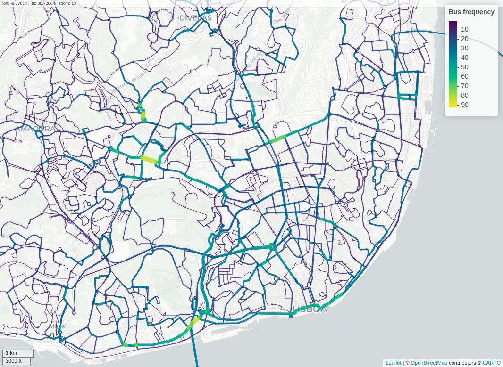
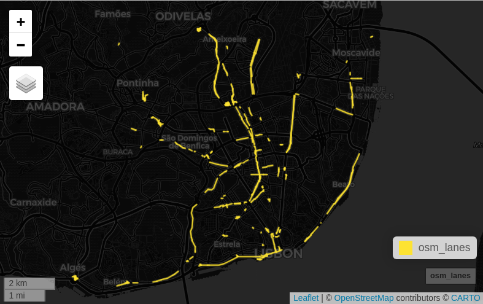

```{r setup, include=FALSE}
knitr::opts_chunk$set(eval = FALSE,
                      message = FALSE, 
                      warning = FALSE, 
                      out.width = "100%",
                      fig.align = "center",
                      dpi = 300)
```


[](https://doi.org/10.5281/zenodo.16794718)

For paper reproducibility please refer to [paper/paper.Rmd](paper/paper.Rmd) and [paper/paper-code.R](paper/paper-code.R)

## Introduction

This is a method to support the prioritization of bus lanes.

This script helps to identify the road network segments with higher bus frequency, to support planning of BUS lanes.

It uses GTFS data for a given city or region, *overlines* the routes with they hourly frequency, and compares them with existing bus lanes and/or streets with more than 1 lane per direction.

We use mainly two R packages:

-   [**`GTFShift`**](https://u-shift.github.io/GTFShift/) to download and manipulate GTFS data
-   [**`stplanr`**](https://docs.ropensci.org/stplanr) to overline the bus routes

And the data:

-   [GTFS](https://mobilitydatabase.org/) for a given city or region, filtered by the modes that run on-street

-   [OpenStreetMap](https://www.openstreetmap.org) for the same city or region, to compare with the existing Bus lanes.

In this paper we will use the Lisbon municipality as a case study.

## Get GTFS data

Download and merge the existing GTFS for the Lisbon city. In this case there are 2 operators using the roadways: Carris and Carris Metropolitana.

```{r load, cache=TRUE, message=FALSE, warning=FALSE}
library(GTFShift)

# loaf GTFS feeds
gtfs_carris = load_feed("https://gateway.carris.pt/gateway/gtfs/api/v2.8/GTFS") # 114 MB
gtfs_carrismetro = load_feed("https://api.carrismetropolitana.pt/gtfs") # 638 MB
```

```{r hiddenmanipulation, include=FALSE, cache=TRUE, message=FALSE, warning=FALSE}
# remove last 6 digits of shape_id for CM - every release has a different suffix
library(dplyr)
gtfs_carrismetro$shapes = gtfs_carrismetro$shapes |> 
  mutate(shape_id = substring(shape_id, 1, nchar(shape_id)-6))
gtfs_carrismetro$trips = gtfs_carrismetro$trips |>
  mutate(shape_id = substring(shape_id, 1, nchar(shape_id)-6))
```

```{r unify, cache=TRUE, message=FALSE, warning=FALSE}
# unify the feeds in a single GTFS feed
gtfs_lisbon = unify(gtfs_carris, gtfs_carrismetro)
```

## Get bus routes and frequencies

Next, the hourly bus frequency is estimated for each route, for the next business Wednesday, and the geometries are overlined, considering the correspondent OSM routes.

```{r routefrequency, cache=TRUE, message=FALSE, warning=FALSE}
# OSM query for bus networks in Lisbon
library(osmdata)
query = opq("Lisbon")  |>
        add_osm_feature(key = "route",
                        value = "bus") |>
        add_osm_feature(key = "network",
                        value = c("Carris", "Carris Metropolitana")) # operators

# get hourly frequency by shape
frequencies_segment = get_route_frequency_hourly(gtfs = gtfs_lisbon, 
                                                 overline = TRUE, 
                                                 use_osm_routes = query)
```

## Map the results

The results allow for the identification of the street segments with higher bus transit frequency, at morning peak hour.

```{r map}
# filter for the peak hour 8-9am
frequencies_segment_8 = frequencies_segment |> 
  dplyr::filter(hour == 8) # the hour with the highest frequency

mapview::mapview(
  frequencies_segment_8,
  zcol = "frequency",
  lwd = "frequency",
  layer.name = "Bus frequency"
)
```

```{r MapResults, echo=FALSE, eval=TRUE, fig.link="http://www.rosafelix.bike/transit/carris_cm_8h.html"}

```

## Compare with existing bus lanes

Then we can compare with the existing bus lanes from OSM and identify missing BUS lanes - if considering only bus frequency, and not other attributes.



See [`GTFShift::query_osm_bus_lanes.R`](https://github.com/U-Shift/GTFShift/blob/main/R/query_osm_bus_lanes.R) script.

> The information from OpenStreetMap may be incomplete or outdated

## Further research

-   Assess the frequency per direction (in OSM segments is aggregated)
-   Compare with number of lanes per direction
-   Compare with existing bus lanes
-   Weight frequency by vehicle capacity

> Work in progress
