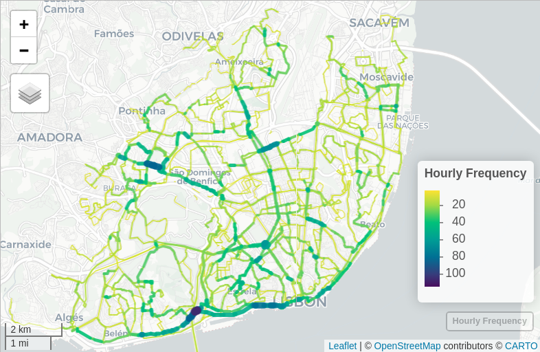
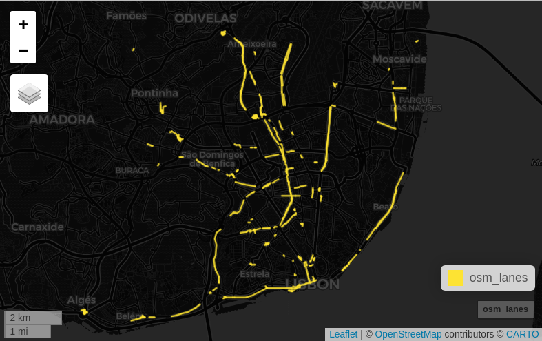

busclaR
================

## Bus lane priorities using GTFS and overline methods

This script helps to identify the road network segments with higher bus
frequency, to support planning of BUS lanes for a given city.

### Requires

- GTFS data (`.zip`)
- The following R packages

``` r
library(tidyverse)
library(tidytransit)
library(sf)
library(stplanr)
library(mapview)
```

## Example in Lisbon

#### Get GTFS data

``` r
bus_oprtator = "carris_lisboa"
gtfs_location = gtfs_location = paste0("data/gtfs/", bus_operator, ".zip")
gtfs = read_gtfs(gtfs_location)
```

#### Filter GTFS for a given date

``` r
date = "2025-04-02" # any weekday date

gtfs_date = filter_feed_by_date(gtfs, extract_date = date)
gtfs_date = gtfs_as_sf(gtfs_date)
```

#### Manipulate data

``` r
trips = gtfs_date$trip
stops = gtfs_date$stops
shapes = gtfs_date$shapes
routes = gtfs_date$routes
stop_times = gtfs_date$stop_times

stop_times <- stop_times %>% 
  left_join(trips) %>% 
  left_join(routes) %>% 
  select(route_id, route_short_name, trip_id, stop_id, service_id,
         arrival_time, departure_time, direction_id, shape_id, stop_sequence)

stop_times <- stop_times %>% 
  filter(stop_sequence == 1) # departures only

stop_times <- stop_times %>% 
  mutate(arrival_hour = lubridate::hour(arrival_time)) # hour in integer format

freq_data <- stop_times %>% 
  group_by(route_id, route_short_name, direction_id, arrival_hour) %>% 
  summarize(freq = n()) %>%
  ungroup()
```

#### Get frequency by route shape

``` r
routes_freq =
  freq_data %>%
  left_join(trips %>%
              select(route_id, direction_id, shape_id) %>%
              distinct()) %>%
  as.data.frame() %>%
  left_join(shapes) %>%
  st_as_sf()

class(routes_freq) # sf   data.frame
```

### Overline

We use the
[`overline2()`](https://docs.ropensci.org/stplanr/reference/overline2.html)
function from the [stplanr](https://docs.ropensci.org/stplanr/) package
to aggregate the road segments and separate them by **bus frequency**.

``` r
# as a function loop for all the hours
routes_freq_all = data.frame()

for (h in 0:23) { # hours of the day
  routes_freq_h = routes_freq %>% 
    filter(arrival_hour == h
           # direction_id = 1  # if needed for only one of the directions
           ) %>%  
    overline2(attrib = "freq") %>% 
    arrange(freq) %>% 
    mutate(hour = h)
  
  routes_freq_all = rbind(routes_freq_all, routes_freq_h)
}
```

We get the road segments with the bus frequency for each hour of the day
(bus line departure hour!).

> Consider using the
> [`overline_intersecttion()`](https://github.com/ropensci/stplanr/issues/420)
> function **over** the `overline2` for smoother results.

### Map

``` r
h = 8 # change the desired hour
routes_freq_hour = routes_freq_all %>% 
  filter(hour == h) 

summary(routes_freq_hour$freq)
```

Min. 1st Qu. Median Mean 3rd Qu. Max. 1.00 5.00 9.00 12.54 16.00 114.00

``` r
mapviewOptions(vector.palette = hcl.colors(palette = "viridis", n = 80, rev = TRUE),
               legend.pos = "bottomright")

mapview(
  routes_freq_hour %>% filter(freq > 2),
  zcol = "freq",
  lwd = "freq",
  layer.name = "Hourly Frequency"
)
```

The result is an interactive map with the bus frequency per road segment
at 8-9h am.



## Compare with existing

Then you can compare with the existing bus lanes from OSM and **identify
missing BUS lanes** - if you consider *only* bus frequency, and not
other attributes.



See [`bus_lanes.R`](code/bus_lanes.R) script.

> The information from OpenStreetMap may be incomplete or outdated
