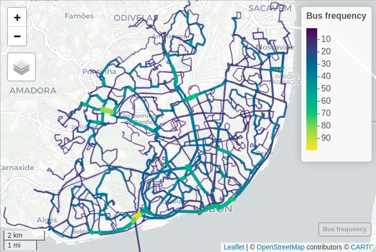

```{r setup, include=FALSE}
knitr::opts_chunk$set(echo = FALSE, 
                      message = FALSE, 
                      warning = FALSE, 
                      out.width = "100%",
                      fig.align = "center",
                      dpi = 300)
```

\textit{Keywords:} Keywords here, but also in the webform.

# Questions

<!-- We can make it shorter and go straight to the problem identification, question and aims. -->

<!-- do Co-Pilot: -->

<!-- Bus lanes are a common measure to improve the performance of public transport systems, especially in urban areas. They are dedicated lanes for buses, allowing them to bypass traffic congestion and improve travel times. This is particularly important in cities where road space is limited and traffic congestion is a significant issue. -->

<!-- The implementation of bus lanes can lead to significant improvements in the efficiency and reliability of public transport systems, making them a more attractive option for commuters. This can help to reduce the number of private vehicles on the road, leading to lower emissions and improved air quality. -->

<!-- This paper presents the GTFShift R package, which provides a set of tools for analyzing bus transit density using the General Transit Feed Specification (GTFS). The package allows users to identify the streets with the highest density of bus frequency, helping to prioritize the implementation of bus lanes in urban areas, and providing decision makers an overview of the network.  -->

Bus lanes (or Transit priority lanes) improve bus operation reliability by reducing the variability of its running time [@surprenant-legault-2011], increasing the average commercial speed that can ultimately be used to increase the frequency of service without additional material or human resources [@basso-2011].
Benefits multiplied by a contiguous network, with the highest savings in travel time verified at intersections [@truong-2015].

See also @szarata2022; @cesme2018.
the last ones also suggest estimated Travel Time Savings Under Various Enforcement Scenarios.

However, introducing them on heterogeneous traffic infrastructure has an impact on other modes, such as private vehicles, that with less space allocated, witness a decrease in the level of service [@arasan-2010], jeopardizing public acceptance [@batty-2014].

The rules of thumb for implementing bus lanes are not well defined, but some common criteria include:
<!-- improve this points -->
-   Hourly frequency of buses and trams at a peak hour
-   Number of lanes (2 or more) in the same direction
-   Existing bus lanes in the area

NACTO suggests that dedicated bus lanes should be applied «on major routes with frequent headways (10 minutes at peak) or where traffic congestion may significantly affect reliability» [@nacto2016transit].
Nevertheless, the decision should be based on a more detailed analysis of the network, including the existing traffic conditions, the number of bus stops, and the overall demand for public transport in the area.

Identifying the corridors with highest bus frequency in the road network is then critical to prioritize new bus lanes, quantify impacts, and justify its implementation.

To support this, this paper presents [`GTFShift`](https://u-shift.github.io/GTFShift/), an open-source R package to identify priorities for bus lanes' implementation.
Based on the analysis of the General Transit Feed Specification (GTFS) data, it extends the capabilities of other R libraries that deal with this transit standard, such as `tidytransit` [@tidytransit] and `GTFSWizard` [@quesadoguimaraes2024].

-   How to get an overview of where bus lanes should be prioritized for a given territory?
-   **Efficient** public transport

> Bus lanes have the potential to significantly improve bus speed and reliability by limiting the negative impacts of traffic congestion ([*6*](https://journals.sagepub.com/doi/10.1177/0361198118791914#bibr6-0361198118791914)).

<!-- When planning bus lanes, we should consider: -->

<!-- -   Roadway Capacity: Bus lanes should be implemented on roads with adequate width to accommodate both bus traffic and other vehicles. -->

<!-- -   Route Length: Bus lanes should be created for a good length of the road, rather than short stretches, to be effective. -->

<!-- -   Traffic Conditions: Careful consideration should be given to traffic flows and potential impacts on other road users, especially on already congested roadways. -->

<!-- -   Public Support: Ensuring sufficient public support for bus lane regulations and enforcement is crucial for success. -->
<!--    THIS IS FROM GOOGLE AI - FIND MANUALS AND GUIDELINES --> 


# Methods

GTFShift is an R package that provides methods for the entire workflow of bus network density analysis.

Starting with the load of the GTFS feed, with `load_feed()` fixing any integrity errors that might hinder the analysis process.

If the GTFS feed location is unknown, it can be queried using `query_mobilitydatabase()`, a method that asks the Mobility Database API for the feeds that match the parameters provided, such as the municipality, country, or even a boundary box.

Then, to expand the scope analysis, it includes a method for aggregating multiple feeds, `unify()`.
`create_calendar()` complements it, solving compatibility issues between feeds with `calendar_dates.txt` only and others with `calendar.txt`.

Narrowing the scope is also possible, using filtering methods according to multiple parameters, such as `filter_by_agency()`, `filter_by_modes()`, and `filter_by_route_name()`.
They extend the filtering already provided by the `tidytransit` R package.

Finally, network density can be analyzed at the stop level, with `get_stop_frequency_hourly()`, or at the route level, with `get_route_frequency_hourly()`.
This analysis is aggregated by stop, route, and hour.

For an aggregated geospatial analysis, the last accepts an `overline` flag, which overlaps routes in street segments, creating a single route network with combined frequencies.
This aggregation is performed using `stplanr::overline2()` [@stplanr].

To compare the streets with higher transit density and the existing bus lanes, `osm_bus_lanes()` allows to export the roads classified as bus lanes in OpenStreetMap, given a bounding box.

We searched for cities with PT networks on OpenStreetMap, that include the tag [`gtfs:shape_id`](https://overpass-turbo.eu/?template=key&key=gtfs%3Ashape_id).
At the time of writing this paper, only [about 10k objects](https://taginfo.openstreetmap.org/keys/gtfs%3Ashape_id) had this tag on OSM - a number relatively low considering the [+300k bus routes](https://taginfo.openstreetmap.org/tags/route=bus) existing on OSM.
<!--# Serão 3.9M ??  https://taginfo.openstreetmap.org/keys/name#combinations -->

# Findings

By applying the methods presented in the previous chapter, it was possible to analyse the bus network density for Lisbon city, in Portugal.
With GTFS data now widely available and accessible tools to process it, this kind of analysis has become much more feasible today.

The analysis was performed using the aggregated feeds of both Carris and Carris Metropolitana, respectively, the urban and sub-urban bus operators in the area.

The results, presented in Figure \ref{fig:MapResults}, allow for the identification of the street segments with higher bus transit density.

```{r, eval=FALSE}
library(dplyr)
library(sf)
# library(tmap)
# tmap_mode("view")
carris_gtfs_osm_overline = st_read("https://github.com/U-Shift/busclar/releases/download/latest/carris_overline.gpkg")
carris_gtfs_osm_overline8 = carris_gtfs_osm_overline |> filter(hour == 8)

map3 = mapview::mapview(carris_gtfs_osm_overline8,
                 zcol = "frequency", 
                          layer.name = "Bus frequency", 
                          legend = TRUE, 
                          lwd = "frequency")
# export as image
map_bus = mapview(bus_lanes, color = "red")
map4 = mapview(
    carris_gtfs_osm_overline8 |> filter(frequency > 10),
    zcol = "frequency",
    layer.name = "Bus frequency",
    legend = TRUE,
    lwd = "frequency"
  )

leafsync::sync(map_bus, map4)
```

```{r MapResults, fig.cap="Road segments with higher bus frequency, in Lisbon, at 8 am. The larger and lighter lines represent the streets with higher hourly bus frequency. Carto basemap.", fig.link="http://www.rosafelix.bike/transit/carris_8h.html"}
# include figure

```

The previous approach, nevertheless, can be problematic if the GTFS shapes do not share the same geometry.
For instance, if the edges of the lines do not overlap or do not follow the same route-over-the-road – which is very common, even besides [GTFS recommendation](https://gtfs.org/documentation/schedule/schedule-best-practices/#shapestxt) – geometries might not be aggregated correctly, causing inconsistent results.

<!-- To overcome this issue, Mobility Data, the organization behind the GTFS standard should provide guidelines or formal requirements to draw or generate the [`shapes.txt`](https://gtfs.org/documentation/schedule/schedule-best-practices/#shapestxt) file, so that they can be aggregated and analysed correctly. -->

As an alternative, *GTFShift* provides the method `network_overline()`, that allows for a route aggregation.
Given a simplified network (generated externally), it identifies the segments corresponding to each route and uses them to aggregate the attribute defined in the parameters.
It can be used to aggregate the routes frequencies.

Additionally, filtering the road network segments by existing number of lanes in the same direction (2 or more) may better support the decision of implementing bus corridors.

The presented replicable method provides an feasible methodology to generate evidence to support decision-making when considering the bus lane network expansion, for a given city.
The data requirements are commonly available for most cities, as GTFS feeds are widely used by public transport operators.
We acknowledge that this evidence may not be sufficient to justify the implementation of bus lanes, as it does not consider other factors such as traffic conditions, public support, and roadway capacity.

Public policies may opt to implement bus lanes in streets with only one lane, or implement dynamic bus lanes (for peak hours only), for instance. 
<!-- improve this idea -->

This method also allows to consider the implementation of dynamic bus lanes (instead of static), by taking into account the hourly frequency – providing evidence for decision on which hours to allocate road lanes for bus.

Further enhancements of the method may include the passenger capacity per hour, instead of the frequency of the number of vehicles.
For instance, bus routes with articulated buses (more than 80 passengers) would weight more than an historical tram route (max 25 passengers).

# Acknowledgements {.unnumbered}

The authors acknowledge Francisco Costa and Manuel Banza for valuable discussion on the refined methods and further developments.
<!--#  and U-Shift. --> R Felix is grateful for the Foundation for Science and Technology's support through funding UIDB/04625/2025 from the research unit CERIS.

# References {.unnumbered}
