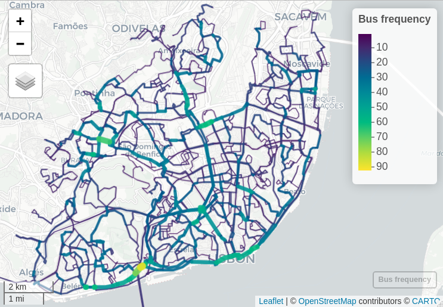

```{r setup, include=FALSE}
knitr::opts_chunk$set(eval = FALSE,
                      message = FALSE, 
                      warning = FALSE, 
                      out.width = "100%",
                      fig.align = "center",
                      dpi = 300)
```

\textit{Keywords:} Bus lanes, GTFS, Network prioritization, R package.

# Questions

<!-- We can make it shorter and go straight to the problem identification, question and aims. -->

<!-- do Co-Pilot: -->

<!-- Bus lanes are a common measure to improve the performance of public transport systems, especially in urban areas. They are dedicated lanes for buses, allowing them to bypass traffic congestion and improve travel times. This is particularly important in cities where road space is limited and traffic congestion is a significant issue. -->

<!-- The implementation of bus lanes can lead to significant improvements in the efficiency and reliability of public transport systems, making them a more attractive option for commuters. This can help to reduce the number of private vehicles on the road, leading to lower emissions and improved air quality. -->

<!-- This paper presents the GTFShift R package, which provides a set of tools for analyzing bus transit density using the General Transit Feed Specification (GTFS). The package allows users to identify the streets with the highest density of bus frequency, helping to prioritize the implementation of bus lanes in urban areas, and providing decision makers an overview of the network.  -->

Bus lanes (or transit priority lanes) have the potential to improve the reliability of bus operations by limiting the negative impacts of traffic congestion [@cesme2018], reducing the variability of travel times [@surprenant-legault-2011], and increasing the average commercial speed -- which can ultimately be used to increase service frequency [@basso-2011].
<!-- without additional material or human resources -->
These benefits are amplified when there is a continuous bus lane network, with the greatest travel time savings at intersections [@truong-2015].
<!-- See also @szarata2022;  -->
However, introducing them on road infrastructure affects other modes, such as private vehicles, which may experience a decrease in the level of service due to reduced allocated space [@arasan-2010], potentially jeopardizing public acceptance [@batty-2014].

Common criteria for implementing bus lanes include:
<!-- improve this points -->

-   Frequency of buses (and trams) per hour and direction, at a peak hour;
-   Number of lanes in the same direction;
-   Existing traffic conditions;
-   Existing bus lanes in the area (from a network continuity perspective).

For instance, NACTO suggests that dedicated bus lanes should be applied «on major routes with frequent headways (10 minutes at peak) or where traffic congestion may significantly affect reliability» [@nacto2016transit].
Nevertheless, the decision should be based on a more detailed analysis of the network, including the existing traffic conditions, the number of bus stops, and the demand for public transport in the area.

@vuchic1981 defends that bus lanes should be implemented based on the number of lanes, vehicle volume per lane, and bus frequency per hour. For instance, the minimum bus frequency for a street with 2 lanes in the same direction and 400 veh/h/lane is considered to be 12 bus/h to justify its implementation, according to the author.

This paper focuses on identifying hourly bus frequency for each road segment, using General Transit Feed Specification (GTFS) data, which is widely available from many transit agencies.
Identifying high-frequency corridors is essential for prioritizing and supporting new bus lane implementation.

For this, we present [`GTFShift`](https://u-shift.github.io/GTFShift/), an open-source R package to identifying bus lane priorities [@gshift2025].
It extends the functionality of other R libraries that deal with this transit standard, such as `tidytransit` [@tidytransit] and `gtfstools` [@gtfstools]. 
<!-- and `GTFSWizard` [@quesadoguimaraes2024]. -->

This tool helps prioritize bus lanes in a given territory to improve transit efficiency.
<!-- remove? -->


# Methods

`GTFShift` is an open-source R package that provides methods for the entire workflow of bus network frequency analysis.
It can be used to get GTFS data for a given territory, and estimate the aggregated bus frequency per street segment at each hour of a given day.

  - [`unify()`](https://u-shift.github.io/GTFShift/reference/unify.html): Merges multiple GTFS feeds into a single entity, enabling an aggregated analysis.
  This method is relevant, for instance, when considering more than one bus operator in the same territory. 
  It extends the functionality of [`gtfstools::merge_gtfs()`](https://ipeagit.github.io/gtfstools/reference/merge_gtfs.html) by enabling the identification of additional transfers.

- [`get_route_frequency_hourly()`](https://u-shift.github.io/GTFShift/reference/get_route_frequency_hourly.html): Calculates the hourly frequency of bus routes for a given day, considering its geometries.
  By default, it estimates the next business Wednesday, relevant for the peak hour.
  The `overline` parameter aggregates all the bus routes that share common line segments, providing a sum of frequencies per street segment, using [`stplanr::overline2()`](https://docs.ropensci.org/stplanr/reference/overline.html) [@stplanr].
  Optionally, using `use_osm_routes` parameter, it retrieves the geometries from *OpenStreetMap* (OSM) by matching the tag `gtfs:shape_id`, overwriting the original GTFS `shapes.txt`. 
<!-- overlapping line segments -->

The parameter `use_osm_routes` is particularly useful if the GTFS shapes do not share the same geometry. 
For instance, if the edges of the lines do not overlap or do not follow the same route-over-the-road – which is very common, even besides [GTFS recommendation](https://gtfs.org/documentation/schedule/schedule-best-practices/#shapestxt) – geometries might not be aggregated correctly, causing inconsistent results.
By relying on a common road network, such as OSM, it is possible to overcome this issue and aggregate the bus routes correctly. 
Nevertheless, the [`gtfs:shape_id`](https://wiki.openstreetmap.org/wiki/Key:gtfs:shape_id) OSM tag is only present in 3.5% of the mapped bus networks.
Alternatively, the [`osm_shapes_match_routes()`](https://u-shift.github.io/GTFShift/reference/osm_shapes_match_routes.html) method can be used to match GTFS shapes with OSM networks, considering their geometrical resemblance.

<!-- To overcome this issue, Mobility Data, the organization behind the GTFS standard should provide guidelines or formal requirements to draw or generate the [`shapes.txt`](https://gtfs.org/documentation/schedule/schedule-best-practices/#shapestxt) file, so that they can be aggregated and analysed correctly. -->

<!-- As an alternative, *GTFShift* provides the method `network_overline()`, that allows for a route aggregation. -->
<!-- Given a simplified network (generated externally), it identifies the segments corresponding to each route and uses them to aggregate the attribute defined in the parameters. -->
<!-- It can be used to aggregate the routes frequencies. -->


The case study is Lisbon, Portugal, where the bus network is operated by *Carris* and *Carris Metropolitana*, respectively, the urban and sub-urban bus operators in the area.

For this article, we used `GTFShift` version v0.6 and `R` version v4.5. <!-- CHANGE TO v0.7 -->

To reproduce the results presented in this paper, refer to [U-Shift/busclar](https://github.com/U-Shift/busclar) code repository.

# Findings

We load the R libraries, the static GTFS feeds for both bus operators, and unify them.

```{r load, cache=TRUE, message=FALSE, warning=FALSE}
library(GTFShift)

# loaf GTFS feeds
gtfs_carris = load_feed("https://gateway.carris.pt/gateway/gtfs/api/v2.8/GTFS") # 114 MB
gtfs_carrismetro = load_feed("https://api.carrismetropolitana.pt/gtfs") # 638 MB
```
```{r hiddenmanipulation, include=FALSE, cache=TRUE, message=FALSE, warning=FALSE}
# create missing calendar.txt
gtfs_carrismetro$calendar = create_calendar(gtfs_carrismetro)

# remove last 6 digits of shape_id for CM - every release has a different suffix
library(dplyr)
gtfs_carrismetro$shapes = gtfs_carrismetro$shapes |> 
  mutate(shape_id = substring(shape_id, 1, nchar(shape_id)-6))
gtfs_carrismetro$trips = gtfs_carrismetro$trips |>
  mutate(shape_id = substring(shape_id, 1, nchar(shape_id)-6))
```
```{r unify, cache=TRUE, message=FALSE, warning=FALSE}
# unify the feeds in a single GTFS feed
gtfs_lisbon = unify(gtfs_carris, gtfs_carrismetro, create_transfers = FALSE)
```
```{r include=FALSE}
## TO-DO: REMOVE THIS AFTER OSM UPDATE
# remove the prefix .x and .y from the variable shape_id
gtfs_lisbon$shapes = gtfs_lisbon$shapes |> 
  mutate(shape_id = gsub("\\.x|\\.y", "", shape_id))
gtfs_lisbon$trips = gtfs_lisbon$trips |> 
  mutate(shape_id = gsub("\\.x|\\.y", "", shape_id))

```

Next, the hourly bus frequency is estimated for each route, for the next business Wednesday, and the geometries are overlined, considering the correspondent OSM routes.

```{r routefrequency, cache=TRUE, message=FALSE, warning=FALSE}
# OSM query for bus networks in Lisbon
library(osmdata)
query = opq("Lisbon")  |>
        add_osm_feature(key = "route",
                        value = "bus") |>
        add_osm_feature(key = "network",
                        value = c("Carris", "Carris Metropolitana")) # operators

# get hourly frequency by shape
frequencies_segment = get_route_frequency_hourly(gtfs_lisbon, 
                                                 overline = TRUE, 
                                                 use_osm_routes = query)
```

The results, presented in Figure \ref{fig:MapResults}, allow for the identification of the street segments with higher bus transit frequency, at morning peak hour.

```{r map}
# filtrer for the peak hour 8-9am
frequencies_segment_8 = frequencies_segment |> 
  dplyr::filter(hour == 8)

mapview::mapview(
  frequencies_segment_8,
  zcol = "frequency",
  lwd = "frequency",
  layer.name = "Bus frequency"
)
```

```{r MapResults, echo=FALSE, eval=TRUE, fig.cap="Road segments with higher bus frequency, in Lisbon, at 8 am. The larger and yellowish lines represent the streets with higher hourly bus frequency. Carto basemap.", fig.link="http://www.rosafelix.bike/transit/carris_8h.html"}
# include figure

```

## TO-DO: continue here

The presented replicable method provides an feasible methodology to generate evidence to support decision-making when considering the bus lane network expansion, for a given city.
The data requirements are commonly available for most cities, as GTFS feeds are widely used by public transport operators.
We acknowledge that this evidence may not be sufficient to justify the implementation of bus lanes, as it does not consider other factors such as traffic conditions, public support, and roadway capacity.

Additionally, subsetting the road network segments by other available OSM data, such as existing number of lanes in the same direction (2 or more), may better support the decision of implementing bus corridors.
Public policies may opt to implement bus lanes in streets with only one lane.
This method also supports the implementation of dynamic bus lanes (instead of static), by taking into account the hourly frequency – providing evidence for decision on which hours to allocate road lanes for bus.

Further enhancements of the method may include the passenger capacity per hour, instead of the frequency of the number of vehicles.
For instance, bus routes with articulated buses (more than 80 passengers) would weight more than an historical tram route (max 25 passengers).

Bus lanes for emergency vehicles, in the approach to hospitals, for instance, could also be considered.


# Acknowledgements {.unnumbered}

The authors acknowledge Francisco Costa for valuable discussion on the further developments.

The authors gratefully acknowledges the support for this research by the Portuguese Foundation for Science and Technology (FCT) funding [PTDC/ECI-TRA/3120/2021](https://doi.org/10.54499/PTDC/ECI-TRA/3120/2021) from STREETS4ALL Project.
R Félix and F Moura are grateful for the FCT support through funding UIDB/04625/2025 from the research unit CERIS.

# References {.unnumbered}
