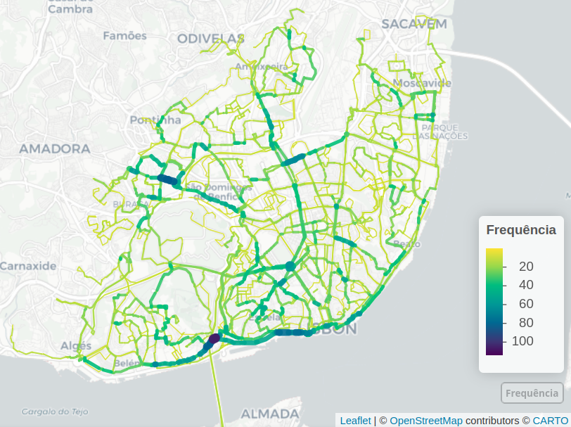

```{r setup, include=FALSE}
knitr::opts_chunk$set(echo = FALSE, 
                      message = FALSE, 
                      warning = FALSE, 
                      out.width = "100%",
                      fig.align = "center",
                      dpi = 300)
```


\textit{Keywords:} Keywords here, but also in the webform.


# Questions

<!-- We can make it shorter and go straight to the problem identification, question and aims. -->

<!-- do Co-Pilot: -->
<!-- Bus lanes are a common measure to improve the performance of public transport systems, especially in urban areas. They are dedicated lanes for buses, allowing them to bypass traffic congestion and improve travel times. This is particularly important in cities where road space is limited and traffic congestion is a significant issue. -->
<!-- The implementation of bus lanes can lead to significant improvements in the efficiency and reliability of public transport systems, making them a more attractive option for commuters. This can help to reduce the number of private vehicles on the road, leading to lower emissions and improved air quality. -->
<!-- This paper presents the GTFShift R package, which provides a set of tools for analyzing bus transit density using the General Transit Feed Specification (GTFS). The package allows users to identify the streets with the highest density of bus transit, helping to prioritize the implementation of bus lanes in urban areas.  -->


Bus lanes improve bus operation reliability by reducing the variability of its running time [@surprenant-legault-2011], increasing the average commercial speed that can ultimately be used to increase the frequency of service without additional material or human resources [@basso-2011]. Benefits multiplied by a contiguous network, with the highest savings in travel time verified at intersections [@truong-2015]. 

However, introducing them on heterogeneous traffic infrastructure has an impact on other modes, such as private vehicles, that with less space allocated, witness a decrease in the level of service [@arasan-2010], jeopardizing public acceptance [@batty-2014]. Identifying the most critical corridors in the network is then critical to quantify impacts, justify, and prioritize interventions.  

GTFShift package provides tools for this process, focused on geospatial analysis of the density of the network per street segment. Based on the analysis of the General Transit Feed Specification (GTFS), it extends the capabilities of other R libraries that work with this transit standard, such as tidytransit [@tidytransit] and GTFSWizard @quesadoguimaraes2024]. 


* How to get an overview of where bus lanes should be prioritized for a given territory?


# Methods

GTFShift is an R package that provides methods for the entire workflow of bus network density analysis. 

Starting with the load of the GTFS feed, with `load_feed()` fixing any integrity errors that might hinder the analysis process. 

If the GTFS feed location is unknown, it can be queried using `query_mobilitydatabase()`, a method that asks the Mobility Database API for the feeds that match the parameters provided, such as the municipality, country, or even a boundary box.

Then, to expand the scope analysis, it includes a method for aggregating multiple feeds, `unify()`. `create_calendar()` complements it, solving compatibility issues between feeds with `calendar_dates.txt` only and others with `calendar.txt`.

Narrowing the scope is also possible, using filtering methods according to multiple parameters, such as `filter_by_agency()`, `filter_by_modes()`, and `filter_by_route_name()`.
They extend the filtering already provided by the tidytransit package.

Finally, network density can be analyzed at the stop level, with `get_stop_frequency_hourly()`, or at the route level, with `get_route_frequency_hourly()`.
This analysis is aggregated by stop, route, and hour.

For an aggregated geospatial analysis, the last accepts an `overline` flag, which overlaps routes in street segments, creating a single route network with combined frequencies.
This aggregation is performed using `stplanr::overline2()` [@stplanr].

To compare the streets with higher transit density and the existing bus lanes, `osm_bus_lanes()` allows to export the roads classified as bus lanes in OpenStreetMap, given a bounding box.

# Findings

By applying the methods presented in the previous chapter, it was possible to analyse the bus network density for Lisbon city, in Portugal.

The analysis was performed using the aggregated feeds of both Carris and Carris Metropolitana, respectively, the urban and sub-urban bus operators in the area. 

The results, presented in Figure \ref{fig:MapResults}, allow for the identification of the street segments with higher bus transit density. 

```{r MapResults, fig.cap="Road segments with higher bus frequency, in Lisbon. The larger and darker lines represent the strteets with higher hourly bus frequency. Carto basemap.", fig.link="http://www.rosafelix.bike/transit/carris_lisboa_8-9h.html"}
# include figure

```

The previous approach, nevertheless, can be problematic if the GTFS shapes do not share the same geometry.
For instance, if the edges of the lines do not overlap, lines might not be aggregated correctly, causing inconsistent results.
As an alternative, *GTFShift* provides the method `network_overline()`, that allows for an alternative route aggregation.
Given a simplified network (generated externally), it identifies the segments corresponding to each route and uses them to aggregate the attribute defined in the parameters.
It can be used to aggregate the routes frequencies.

Additionally, filtering the road network segments by existing number of lanes in the same direction (2 or more) may better support the decision of implementing bus corridors.


# Acknowledgements{.unnumbered}

The authors acknowledge Francisco Costa and Manuel Banza for valuable discussion on the refined methods and further developments.
R Felix is grateful for the Foundation for Science and Technology's support through funding UIDB/04625/2025 from the research unit CERIS.

# References{.unnumbered}

