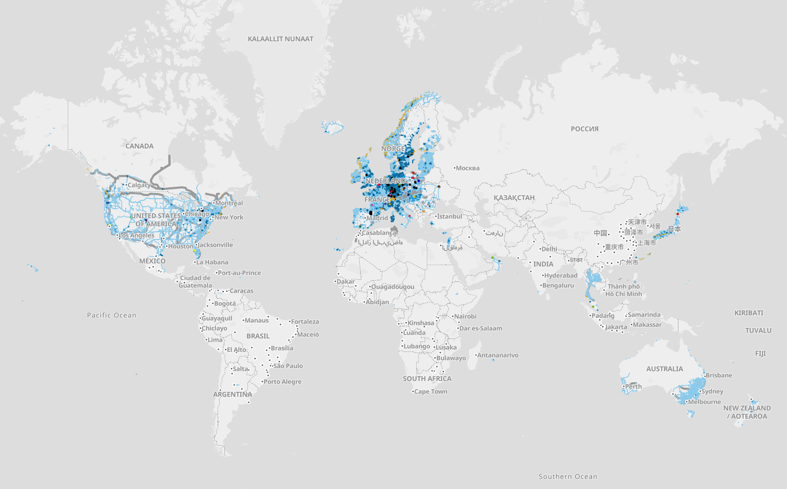

\textit{Keywords:} GTFS, OpenStreetMaps, Transit planning, Network analysis, R package.

# Introduction

<!-- Add graph of gtfs povision on mobility data -->

<!-- Explain GTFS structure and OSM bus relation topology -->

<!-- Show example of geometry mismatch between shapes of same operator: Carris Metropolitana and two different ones -->

# Related work

## Using GTFS for spatial analysis

<!-- Mention case specific analysis, mostly graph oriented -->

## Associating GTFS and OSM data 

<!-- Mention papers that associate GTFS and OSM data and their limitations -->

# Methodology

# Application

<!-- Show frequency map, number of lanes, bus lanes --> 

<!-- Elaborate on aggregated analysis unlocking new planning instruments, such as bus lane prioritization, preparing next paper -->

# Conclusion
