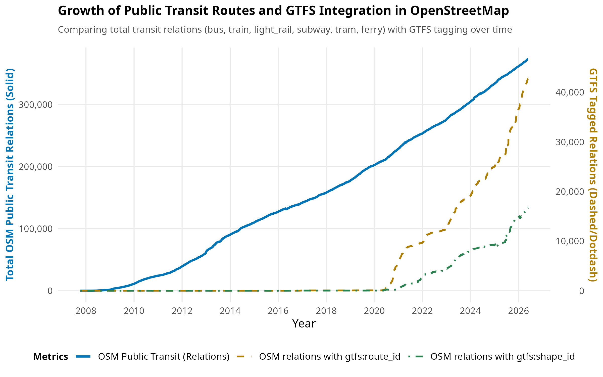
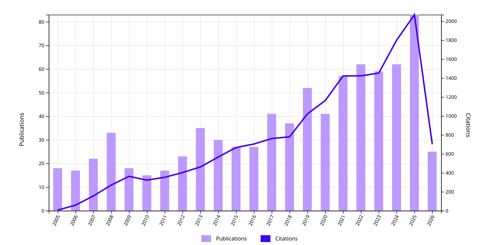
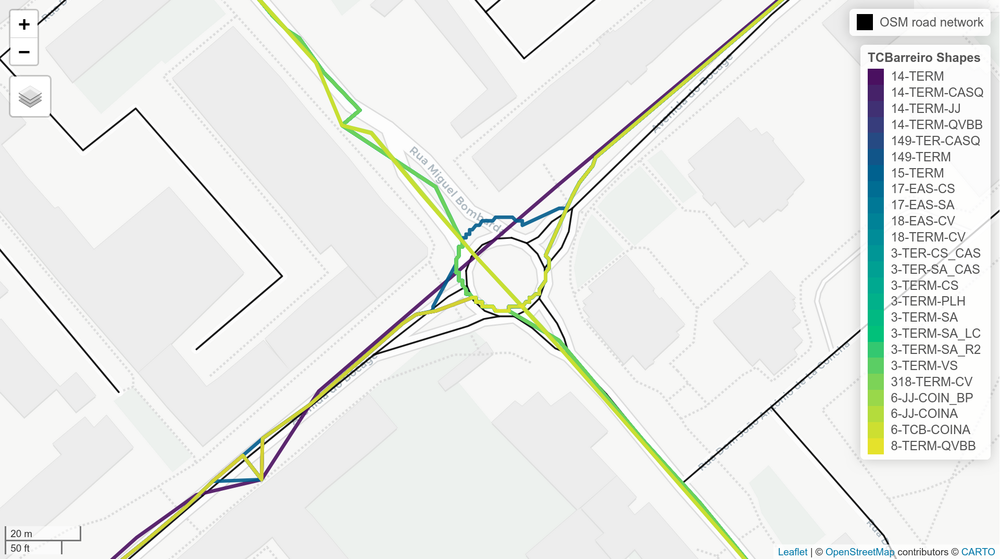
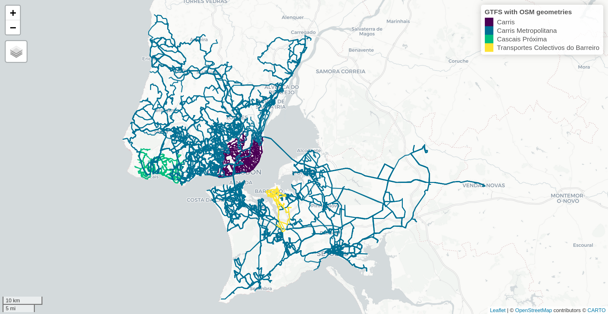
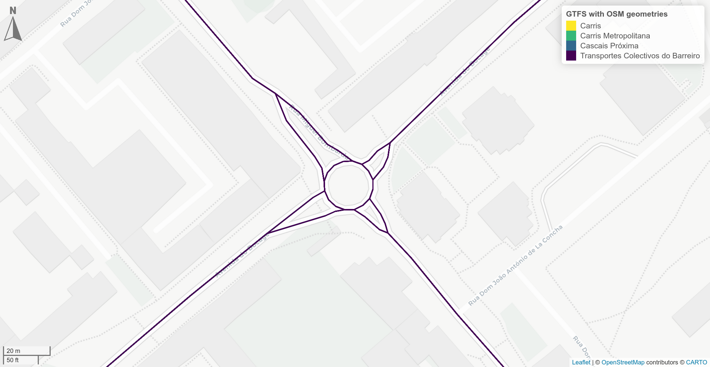

# Introduction

Twenty years after its conception by Trimet and Google [@goldstein_pioneering_2013], the General Transit Feed Specification (GTFS) is growing into a widespread language for the diffusion of public transport data.
It consists of a simple open data standard that uses plain text files to describe the service offered by public transport agencies, such as routes, stops, trips, their schedules and geometrical shapes [@mobilitydata_what_nodate].

The adoption of this standard by transport agencies has been increasing steadily in the past years, as seen in @fig-gtfs-growth, with Transitland reporting almost 6,000 publicly available GTFS feeds in 2026 [@transitland_atlas_repo].
Its coverage is centered in North America, Europe, Thailand, Japan, Australia and New Zealand [@transitland_map].
Nevertheless, there are GTFS feeds in other regions, with a more limited geographical scope.
Some examples are Bogotá (Colombia), Managua (Nicaragua), or Algoa (South Africa). 

::: {layout="[[50,-3,50]]"}
![Total number of GTFS feeds indexed by Transitland, since 2016 [@transitland_atlas_repo]](charts/transitland_atlas/feed_counts_by_year.png){#fig-gtfs-growth}

{#fig-osm-gtfs-growth }
:::

This progressively increasing availability of detailed public transport data has been promoting the diversity and quality of trip planning apps and services, improving the travelling experience for passengers [@goldstein_pioneering_2013], but also feeding a growing body of academic research [@web_of_science_citation_nodate], namely focused on spatial analysis of public transport networks.
An analysis that ranges from simple visualization techniques to more complex models that aggregate information from multiple agencies and relate them with other dimensions, such as the built infrastructure. 

<!--A quick search in Web of Science database for "GTFS" related papers shows a clear increasing trend in publications and citations in the past years, reaching 22 papers in 2025, mostly from Transportation (58.79%), Computer Science (39.87%) and Geography (25.00%) research areas [@web_of_science_citation_nodate]^[Search for authoer keywords, keyword plus, topic or title containing "GTFS" word].-->

<!--  -->

However, the lack of standardization in GTFS shapes still presents some challenges for a proper spatial analysis.
@fig-gtfs-shapes-mess-tcb illustrates an example of this issue for the Transportes Coletivos do Barreiro (Barreiro, Portugal) GTFS feed, where the geometries for different shapes that follow the same path do not overlap with each other, neither with the OpenStreetMap (OSM) road network, or other map providers.
An issue that has been identified in the GTFS community [@gtfs_shapes_github_discussion] and in the literature [@vuurstaek_gtfs_2020], but that remains unresolved. 
Nevertheless, the solution will unlikely come from the GTFS standard evolution, as it requires a denormalized representation of public transport in order to support all the different modes and their specificities, such as subways or ferries, that have shapes which are not part of the road network. 

<!-- Mention GTFSS isssues-->
<!-- https://github.com/google/transit/issues?q=is%3Aissue%20state%3Aopen%20shapes -->
<!-- https://github.com/google/transit/issues/477 -->
<!-- https://github.com/google/transit/issues/459 -->

{#fig-gtfs-shapes-mess-tcb width="75%"}


As an alternative, OSM provides its own public transport geometries through route relations.
Made up of a set of OSM stop nodes and road ways, route relations describe "the physical path taken by the vehicles through the infrastructure by a transit service" [@openstreetmap_public_nodate].
Their availability has been growing, with more than 300,000 public transport route relations documented in OSM until May 2026, as shown in @fig-osm-gtfs-growth.
Nevertheless and despite the OSM including attributes to associate relations to the GTFS feed, such as `gtfs:shape_id` and `gtfs:route_id` [@openstreetmap_gtfs_nodate], their usage is still minimal, accounting for only 4.52% and 11.46% of the route relations.

Therefore, associating GTFS and OSM data requires conflation.
This process, also known as map matching, is defined as the combination of "geographic information from overlapping sources so as to retain accurate data, minimize redundancy, and reconcile data conflicts" [@longley_geographic_2001].
However, this is not a trivial process.
When the input data comes from different sources, conflation may lead to several challenges, such as the loss of data quality, topological inconsistencies, or the mismatch of geometries [@vuurstaek_gtfs_2020].

GTFShift was developed to address these challenges.
It is an R package that provides an alternative methodology to harmonize GTFS shapes with the OSM network.
Instead of complex path-finding or map matching algorithms that are prone to errors in dense areas, it leverages the detailed route geometries that already exist in the OSM database as route relations, overcoming the missing attributes to associate them with the GTFS feed through a geometrical match algorithm.
It encompasses the full pipeline to read, filter, manipulate, analyse and match shapes with OSM geometries, enabling the conversion of any GTFS feed to the OSM network.
This paper presents GTFShift methodology and its validation through an example of application to the Lisbon Metropolitan Area, in Portugal.

# Related work

## Using GTFS for spatial analysis

GTFS has been used to perform a diversity of spatial analysis.
Some authors used GTFS data to visualize and analyse operational characteristics such as speed, flow, density, headways or even stop spacing [@prommaharaj_visualizing_2020; @devunuri_gtfs_2024; @cirreltpolytechnique_montreal_innovative_2016].
Others have related it with sociodemographic data to assess access to opportunities [@karner_assessing_2018; @goliszek_potential_2020; @ivan_spatio_temporal_2017; @falchetta_comparing_2021; @kim_more_2019; @kujala_travel_2018].
Then, there are also authors that extended the previous analyses with real-time information, either to compute operational performance metrics such as on-time performance, schedule adherence, or service reliability [@godfrid_analyzing_2022; @aemmer_measurement_2022], but also to analyse the effective accessibility provided the travel time innaccuracy and variability [@braga_evaluating_2023; @liu_realizable_2023].
However, all of these analysis are restricted to the GTFS feed context, considering either their geometries or generating a graph of stops and connections, without explicitly taking into consideration the actual road network - relevant for _bus_ mode.


## Associating GTFS and OSM data 

Some authors have tryed to address the OSM-GTFS association problem.
@vuurstaek_gtfs_2020 has developed a methodology to map GTFS bus geometries to the OSM network, but limited to bus stops.
@perrine_map_matching_2015 has proposed a more complex approach that maps both the bus stops and the routes geometries by projecting GTFS points to the OSM network and performing shortest path algorithms.
However, the authors acknowledge its limitations when "the track points or the underlying map coordinates are biased, (...) possibly causing selection of adjacent roads in central disticts or service roads instead of freeways".

Outside of the academic sphere, there are several tools that connect GTFS and OSM data.
OSM wiki [@openstreetmap_gtfs_nodate] lists some of these tools, grouping them in two main categories:

- **OSM \rightarrow GTFS**: This category gathers tools mainly oriented to generate GTFS feeds from OSM data, either computing approximate stop times from the OSM attributes on service frequency [@noauthor_jungle_busprism_2025] or requiring the manual provision of more complete schedules [@grote_groteosm2gtfs_2026; @noauthor_hiposfero2g_2026; @gamma_gammapopolamosm2gtfs_2025];

- **GTFS \rightarrow OSM**: Focused on comparing GTFS and OSM data to identify mismatches [@kokanovic_stalker314314gtfs_osm_validator_2024; @horner_tjhornergtfs_janitor_2026] and providing bus route geometries to the OSM network by using different routing algorithms [@hubsch_whubschgtfstoosm_2026; @gabriele_gabboxlgtfs_osm_import_2026].

These tools, specially those in the second category, provide useful methodologies for GTFS-OSM association.
However, the ones that generate geometries rely on routing algorithms, ignoring the database of already existing route relations in OSM.

# Methodology

GTFShift R package provides a pipeline for the complete workflow of GTFS-OSM conflation.
The tutorial, documented at [https://u-shift.github.io/GTFShift/articles/gtfs_from_osm.html](https://u-shift.github.io/GTFShift/articles/gtfs_from_osm.html), follows a workflow encompassing the following steps, further detailed:

1.
`GTFShift::load_feed()`: Read GTFS feed, fixing integrity errors;
2.
`GTFShift::osm_shapes_match_routes()`: Match GTFS shapes with OSM relations, based on geometrical correspondence;
3.
`GTFShift::create_shapes_from_sf()`: Build shapes table from OSM geomerties.


## Data loading and integrity fixes

The first step of the workflow is to load the GTFS feed using the `GTFShift::load_feed()` function.
This function orchestrates several methods from GTFShift and other packages to read the feed and fix integrity errors.
It starts by loading the feed using `tidytransit::load_feed()` [@r_tidytransit].
Then, it verifies the feed's integrity and corrects any errors found, such as empty `stop_times`, that would otherwise lead to errors in the subsequent steps. 

If the `shapes` table is missing or empty, it is generated using `GTFShift::create_shapes_from_stops()`.
This function builds the `shapes` by grouping trips with the same stop sequence and assigning them the same `shape_id`.
The resulting shapes are a simplified version of the original ones, as they do not take into account the actual path followed by the vehicles, but only the stop sequence.
However, they are a good enough proxy to enable the geometrical match with OSM relations in the next step.

Finally, the method also includes an optional flag to construct the `transfers` table, which calls `gtfsrouter::gtfs_transfer_table()` [@r_gtfsrouter] and enables the specification of stops where transfers are feasible, to optimize routing analysis that might be performed over the generated GTFS feed, allowing for transfers.

## Match GTFS shapes with OSM relations

The `GTFShift::osm_shapes_match_routes()` function enables the matching of GTFS shapes with OSM relations based on geometrical correspondence.
For that, it requires a GTFS feed (loaded in the previous step) and a query that specifies the OSM public transport network over which the shapes will be matched (a filter for OSM route relations using parameters such as [`network`](https://wiki.openstreetmap.org/wiki/Key:network) or [`operator`](https://wiki.openstreetmap.org/wiki/Key:operator)) defined using `osmdata::opq()` [@r_osmdata].

Internally, after fetching the OSM public transport network data that matches the query (a set of OSM route relations), the algorithm identifies the subset of OSM routes relations that match each GTFS route (based on the route identifier).
Then, for each shape, the geometrical match is performed considering the OSM route $j$ that minimizes the closeness metric $C(i, j)$ for GTFS shape $i$.
The matching algorithm is formulated as follows:

**1.
Filtering and Base Data Selection:** Let $R$ be a GTFS route identifier and $\mathcal{O}_R = \{O_1, \dots, O_m\}$ be the set of candidate OSM route relations matching $R$.
The set of GTFS shapes associated with route $R$ is also retrieved, denoted as $\mathcal{S}_R = \{S_1, \dots, S_n\}$.

**2.
Feature Extraction:** For each GTFS shape $S_i \in \mathcal{S}_R$:

* Extract the start and end coordinates of its trips' first and last stops: $\text{init}_{GTFS, i}$ and $\text{fin}_{GTFS, i}$.
* Compute the shape's total length $L_{GTFS, i}$ and the number of stop times $N_{stops, i}$.

For each candidate OSM route relation $O_j \in \mathcal{O}_R$:

* Extract the coordinates of the first and last stops: $\text{init}_{OSM, j}$ and $\text{fin}_{OSM, j}$.
* Compute the relation's geometry length $L_{OSM, j}$ and the number of stop nodes $N_{stops, j}$.

**3.
Closeness Metric Evaluation:** For each GTFS shape $S_i$, the closeness metric $C(i, j)$ is calculated for all candidate OSM routes $O_j \in \mathcal{O}_R$:

$$C(i, j) = d(\text{init}_{GTFS, i}, \text{init}_{OSM, j}) + d(\text{fin}_{GTFS, i}, \text{fin}_{OSM, j}) + |L_{GTFS, i} - L_{OSM, j}| + \frac{L_{GTFS, i}}{N_{stops, i}} \cdot |N_{stops, i} - N_{stops, j}|$$

where:

* $d(\cdot)$ is the Euclidean distance between stops.
* The term $\frac{L_{GTFS, i}}{N_{stops, i}}$ represents the average distance between stops on the GTFS shape, serving as a scale factor for the difference in the number of stops.

Shape $S_i$ is associated with the OSM route $O_{j^*}$ that minimizes the closeness metric:

$$j^* = \operatorname{argmin}_{j} C(i, j)$$

**4.
Conflict Resolution:** If multiple GTFS shapes are associated with the same OSM route $O_j$, only the shape $S_i$ that minimizes the closeness metric is retained.
The other conflicting shapes are ignored and a warning is triggered.

During the algorithm execution, detailed warning logs are prompted to the console to indicate any potential issues, such as GTFS routes without any OSM relation match or OSM relations with entry/exit stops that do not respect the GTFS order (which might indicate OSM data integrity issues).
@lst-match-logs exemplifies the warnings displayed to the user, which can be used to identify potential issues in the GTFS feed or OSM data.

```{#lst-match-logs .r lst-cap="Sample of warning logs during the GTFS-OSM match process"}
WARNING!  4 error(s) were GTFS routes that had multiple shapes associated to the same osm route (routes ignored):
(This might indicate a mismatch between GTFS and OSM data)
> `route_short_name` 1 has 10 shapes, but the geometrical match returned only 6 (out of 6) OSM routes
>> `osm_id` for route: 18957440, 18957438, 18957439, 18957436, 18957437, 9448621
>> The ignored ones were: 
>> The duplicated ones were: 18957440, 18957438
>> Returning shapes that have greatest geometrical match: 1-TERM-FT, 1-TERM_EA, 1-QVB-TER_EA, 1-QVBB-TERM, 1-VA-TERM, 1-TERM
>> Shapes ignored: 11-EAS-PTABB, 11-PTABB-EAS, 11-EAS-BB, 11-BB-EAS
...
```

The result is a `sf` `data.frame` that associates each GTFS `shape_id` with an OSM route relation `osm_id` and its respective geometry, as exemplified in @lst-match-result.
Additionally, it includes the heuristic values for the closeness metric, which can be used to evaluate the quality of the match (columns `distance_diff`, `points_diff` and `stops_diff`).


```{#lst-match-result .r lst-cap="Sample of match result for TCB"}
Simple feature collection with 69 features and 5 fields
Geometry type: MULTILINESTRING
Dimension:     XY
Bounding box:  xmin: -9.084416 ymin: 38.5716 xmax: -9.011861 ymax: 38.6741
Geodetic CRS:  WGS 84
First 10 features:
       shape_id   osm_id distance_diff points_diff stops_diff                           geom
1     1-TERM-FT 18957436         49.17       14.59         24 MULTILINESTRING ((-9.078279...
2     1-TERM_EA 18957437         31.32       11.85         28 MULTILINESTRING ((-9.078279...
3  1-QVB-TER_EA 18957438        281.71     2033.65         15 MULTILINESTRING ((-9.050197...
4   1-QVBB-TERM 18957439        133.54      408.51         20 MULTILINESTRING ((-9.050197...
5     1-VA-TERM 18957440         77.81       78.94         12 MULTILINESTRING ((-9.039743...
```

## Build shapes table from OSM geometries

Despite having the GTFS-OSM association performed, it is still necessary to convert the OSM geometry into the GTFS `shapes` table format, a sorted sequence of points that represent the path followed by the vehicles in each route [@gtfs_shapes_reference].
`GTFShift::create_shapes_from_sf()` implements this functionality.

It supports either LINESTRING or MULTILINESTRING geometries as in input, recurring internally to `GTFShift::multiline_to_sorted_linestring()` in order to standardize all geometries into a single LINESTRING.
This is a crutial step, as OSM bus relations are MULTILINESTRING geometries, which consist of unordered collections of line segments (OSM ways), that if converted without a previous sorting process could lead to inconsistencies in the final GTFS shapes.
The sorting criteria is based on the following procedure:


Let $\mathcal{L} = \{L_1, \dots, L_n\}$ be the set of individual LINESTRING components.
Each component $L_i$ is characterized by its start point $S(L_i)$ and end point $E(L_i)$.

**1.
Initialization:**
Let $P_{\text{start}}$ be the starting point, corresponding to the location of the first GTFS stop for that route relation.
The first segment $L^{(1)}$ in the sorted sequence is selected as:
$$L^{(1)} = \operatorname{argmin}_{L \in \mathcal{L}} d(P_{\text{start}}, L)$$
where $d(\cdot)$ is the Euclidean distance.
If $d(P_{\text{start}}, S(L^{(1)})) > d(P_{\text{start}}, E(L^{(1)}))$, the component's geometry is reversed so that it starts near $P_{\text{start}}$.

The set of remaining segments is initialized as $\mathcal{R}^{(1)} = \mathcal{L} \setminus \{L^{(1)}\}$.

**2.
Iterative Step:**
For each step $k \ge 1$, let $L^{(k)}$ be the current segment and $E^{(k)} = E(L^{(k)})$ its endpoint.
The algorithm searches the remaining components $\mathcal{R}^{(k)}$ for the closest segment:
$$L_{\text{start}} = \operatorname{argmin}_{L \in \mathcal{R}^{(k)}} d(E^{(k)}, S(L))$$
$$L_{\text{end}} = \operatorname{argmin}_{L \in \mathcal{R}^{(k)}} d(E^{(k)}, E(L))$$
Let $d_{\text{start}} = d(E^{(k)}, S(L_{\text{start}}))$ and $d_{\text{end}} = d(E^{(k)}, E(L_{\text{end}}))$.
The candidate segment $L^*$ is:
$$L^* = \begin{cases} L_{\text{start}} & \text{if } d_{\text{start}} < d_{\text{end}} \\ L_{\text{end}} & \text{otherwise} \end{cases}$$

{width="75%"}

**3.
Verification & Assembly:**
If the distance between the current segment and the candidate exceeds their combined length:
$$d(L^{(k)}, L^*) > \text{len}(L^{(k)}) + \text{len}(L^*)$$
then $L^*$ is discarded, $\mathcal{R}^{(k+1)} = \mathcal{R}^{(k)} \setminus \{L^*\}$ and we find the next candidate.
Otherwise, $L^{(k+1)} = L^*$ (reversed if $L^* = L_{\text{end}}$) and $\mathcal{R}^{(k+1)} = \mathcal{R}^{(k)} \setminus \{L^*\}$.
This prevents disconnected segments from being included in the final geometry.

The process repeats until no segments remain, and the components are merged into a single `LINESTRING`. 

{width="75%"}

Once the geometry is standardized into sorted linestrings, it is convert into the GTFS `shapes` table using `gtfstools::convert_sf_to_shapes()` [@r_gtfstools]. 


# Application

Lisbon Metropolitan Area (LMA) was chosen as study area to demonstrate and validate the application of the GTFShift methodology presented in this paper^[All the code scripts executed to generate the outputs presented in this section are available at [github.com/U-Shift/busclar/tree/main/paper_methodology/scripts](https://github.com/U-Shift/busclar/tree/main/paper_methodology/scripts)].
With a population of 2.8 M residents [@ine_populacao_2022], it is served by a dense public transport network that covers its 18 municipalities, built up on rail, fluvial and road services provided by nine private and public operators [@tml_transportes_nodate].
This analysis will focus on the services for a working day, considering the bus mode and its four operators:

- **Carris**, the urban operator for the municipality of Lisbon;
- **TCB**, the urban operator for the municipality of Barreiro;
- **MobiCascais**, the urban operator for the municipality of Cascais;
- **Carris Metropolitana**, the urban operator for the remaining 15 municipalities in the LMA and the sub-urban connections among the 18.

@tbl-operator-network-characteristics presentes some metrics regarding each operator's network and @fig-aml-shapes-osm depicts their spatial coverage. Carris Metropolitana is the operator with the largest network, presenting the highest values for all indicators, due to its metropolitan coverage and the sub-urban nature of most of its routes. The remainder operators have shorter routes and less stops per trip, as they operate mostly within their respective municipalities. Still, Carris presents a substantial number of trips, as it operates in the capital city of Lisbon, with a inherent higher demand for public transport.

| Operator | Shapes (n) | Shapes peak¹ (n) | Trips (n) | Trips peak¹ (n) | Shapes length² (km) | Stops per trip² (n) | 
| :---- | --: | ---: | --: | ---: | ----: | ----: | 
| Carris | 263 | 176 | 10100 | 1235 | 10.25 ± 4.72 | 29.29 ± 11.71 |
| TCB | 60 | 31 | 964 | 111 | 10.70 ± 5.91 | 24.95 ± 8.99 |
| MobiCascais | 130 | 86 | 2053 | 236 | 12.65 ± 5.36 | 30.98 ± 14.84 |
| Carris Metropolitana | 1533 | 1056 | 21712 | 2900 | 17.44 ± 10.32 | 34.13 ± 16.17 |

: Operator network characteristics based on GTFS data {#tbl-operator-network-characteristics}

\begin{quote}
\footnotesize
\textbf{Notes:} GTFS data filtered for 27/05/2026 (working day). ¹ Considering services between 08:00 and 09:00. ² Mean value and standard deviation.
\end{quote}


{#fig-aml-shapes-osm width="75%"}

After loading the GTFS feeds for each operator without relevant integrity issues^[Despite not representing integrity issues, MobiCascais GTFS feed was manipulated after loaded to adjust some attributes that were not adequate for the match with OSM route relations.
Specifically, the `route_short_name` column of the `routes` table, in which route references were presented as integers, was adjusted to follow the format `M%02d` (e.g.
`1` was changed to `M01`) to enable the match with the OSM route relations `ref` attribute.] ^[Despite not representing integrity issues, Carris Metropolitana GTFS feed was manipulated after loaded to adjust some attributes that were not adequate for reproducibility.
Specifically, the `shape_id` column of the `shapes` table was adjusted to remove an unique serial number generated for every GTFS feed update and that does not hold any meaning in the context of the routes shape (e.g.
`[P6Q8K]2306_1_1` was changed to `2306_1_1`).], the `GTFShift::osm_shapes_match_routes()` method was called for each operator's GTFS feed to match the GTFS routes shapes with the OSM route relations.

The results, presented at @tbl-osm-match-results, demonstrate a high match rate, above 90% for all operators, that increases when considering the services at peak hour.
This filter enables to evaluate the match quality for the moment when there is the highest concentration of service provision (usually the focus of aggregated analysis), disregarding route variations and shortenings that tend to occur outside peak hours, are less frequent and therefore less prone to be mapped to OSM.
Additionally, the analysis considering the number of trips covered by the match is also presented, with a higher match rate for most operators, suggesting that the geometries matched are the ones with highest frequencies. 

| Operator | Matched shapes (%) | Matched shapes peak¹ (%) | Matched trips (%) | Matched trips peak¹ (%) |
| :----- | ----: | ----: | ----: | ----: | 
| Carris | 99.62 | 100 | 99.96 | 100 | 
| TCB | 91.66 |  100 | 96.78 | 100 | 
| MobiCascais | 94.62 | 96.51 | 97.27 | 96.61 |
| Carris Metropolitana | 98.96 | 99.53 | 99.36 | 99.76 |

: Results of the match between GTFS routes shapes and OSM route relations for each operator {#tbl-osm-match-results}

\begin{quote}
\footnotesize
\textbf{Notes:} GTFS data filtered for 27/05/2026 (working day). ¹ Considering services between 08:00 and 09:00. 
² Only displaying number of trips for peak hour because GTFS feeds from diferent operators cover different timespans and therefore the total number of trips is not comparable.
\end{quote}


@tbl-osm-match-heuristic complements this analysis, disclosing the mean values and standard deviation for the route length, start/end points distance and number of stop points diffence.
Its analysis reveals that the heuristic performance varies across operators, highlighting distinct challenges in network sizes and data consistency. 
The critical analysis of these values is essential to understand the quality of the match and the potential implications for subsequent spatial analyses.

Manual validations on the outliers of each heuristic revealed interesting patterns. 
Carris high deviation in route length difference is explained by the poor quality of its GTFS shapes, which have an inconsistent sequence of points, such as starting points in the middle of the route, leading to an invalid geometry that has much higher length than the actual route. 
This issue has been flagged by MobilityData in their GTFS Validation Reports [@mobilitydata_gtfs_2026]. 
MobiCascais, on the other hand, stands out for its high deviation in the number of stop points difference, caused by the high number of route variants that are not mapped in OSM, leading to a poorer match quality.

| Operator | Heuristic length (m)¹ | Heuristic points (m)¹ | Heuristic stops (n)¹ |
| :---- | ---- | ---- | ---- |
| Carris | 278.9 ± 1300.6 | 45.4 ± 176.7 | 0.38 ± 0.70 |
| TCB | 146.6 ± 202.4 | 84.0 ± 359.2 | 0.11 ± 0.31 |
| MobiCascais | 130.5 ± 447.8 | 161.1 ± 866.6 | 0.46 ± 1.01 |
| Carris Metropolitana | 314.0 ± 466.5 | 72.65 ± 649.3 | 0.40 ± 0.93 |

: Heuristic values for the shapes matched for each operator {#tbl-osm-match-heuristic}


\begin{quote}
\footnotesize
\textbf{Notes:} ¹ Mean value and standard deviation of heuristic that measures shape length, start/end points distance and number of stops difference, respectively.
\end{quote}

<!-- Add https://files.mobilitydatabase.org/mdb-2929/mdb-2929-202605210113/report_8.0.1.html -->

To discard outliers and ensure the quality of the matched routes, a filtering process was applied, where routes with a length difference greater than 1000 meters or start/end point distance greater than 500 meters were removed.
@tbl-osm-match-results-filtered presents the number of shapes that meet this criteria and the updated match rates at peak hour.
MobiCascais and Carris Metropolitana were the operators that presented the greatest reduction, with the first having dropped 12.9 p.p. in the number of shapes matched.
On the other hand, Carris reduced less than 3 percentage points, suggesting it is the operator with the best data quality on OSM.

| Operator | Matched shapes after filtering (n) | Matched shapes peak¹ (%) | Matched trips peak¹ (%) |
| :----- | ---- | ---- | ---- | 
| Carris | 251 | 97.16 | 97.49 |
| TCB | 52 | 90.32 | 96.40 |
| MobiCascais | 117 | 91.86 | 94.49 |
| Carris Metropolitana | 1369 | 92.42 | 94.03 |

: Shapes matched between GTFS routes shapes and OSM route relations for each operator after filtering for outliers {#tbl-osm-match-results-filtered}

\begin{quote}
\footnotesize
\textbf{Notes:} GTFS data filtered for 27/05/2026 (working day). ¹ Considering services between 08:00 and 09:00. 
\end{quote}

A deeper look into the shapes that do not lie in the filtering criteria reveals routes mostly associated with shortenings (usually the first or last trips of the day that depart from or end at the dispatcher), or variants that have less frequency and are therefore less likely to be mapped in OSM.

Finally, the geometries of the OSM route relations matched in the previous step were converted into GTFS `shapes` table format using `GTFShift::create_shapes_from_sf()`. 

The application of the GTFS-OSM conflation process to the bus services in the Lisbon Metropolitan Area enabled the harmonization of GTFS shapes with the OSM road network, improving the quality of the GTFS geometries.

@fig-gtfs-shapes-mess-tcb-fixed illustrates the improvement achieved at Barreiro municipality, where the GTFS shapes for TCB that did not overlap with each other nor with the OSM network (@fig-gtfs-shapes-mess-tcb) were replaced by OSM geometries that follow the road network and overlap with each other.
Actually, they also overlap with Carris Metropolitana, which is not visible in the figure because they have the exact same (OSM) geometries.

{#fig-gtfs-shapes-mess-tcb-fixed width="75%"}

# Conclusion

The GTFS-OSM conflation process described in this paper enabled the harmonization of GTFS shapes with the OSM road network for the bus services in the Lisbon Metropolitan Area.
With an implementation that leverages OSM route relations to avoid complex path-finding or map matching algorithms, it offers a simple yet effective methodology to improve the quality of the GTFS shapes, enabling a more accurate spatial analysis of the public transport network, within and between different operators. 

<!-- Additionally, the usage of an established base geometry has the potential to reduce the amount of information stored at shapes file, by discarding unnecessary intermediate vertices' cordinates, as shown in @fig-gtfs-shapes-mess-tcb, which can be relevant for the storage and processing of GTFS feeds, especially for large networks.
For instance, in the case of TCB, the original GTFS shapes had a total of XXXXX vertices, taking XXX mb, while the result shape file generated with this method was reduced to XXXX vertices, taking only XX mb, which represents a reduction of XX% in the file size. -->

The match between GTFS shapes and OSM routes had a high match rate for all operators, finding a correspondence of up to 97% of all trips at peak hour, which enables a realistic analysis of the public transport network.
Despite not reaching a 100% match, the unlatched association with the OSM network is highly relevant in the context of spatial analysis, as it allows to relate the public transport network with an open database of the built infrastructure, providing indicators such as the number of lanes, maximum speed, type of pavement, parking existence, or the presence of bus lanes.
This unlocks a wide range of modeling possibilities that can be used to support transport planning and policy making.
Future work can leverage this methodology to build comprehensive analysis of the public transport network and the urban environment, for instance, combining public transport frequencies with the road network characteristics to prioritize bus lanes implementation.

This work contributes to a broader discussion on the future of GTFS data, highlighting the potential of OSM as a complementary source of information for public transport networks. Its integration with GTFS can enhance the quality and accuracy of public transport data, providing a more comprehensive understanding of the network and its interactions with the urban environment. Eventually, using a common geographical information base, GTFS could include the segment ids instead of the detailed geometries for each route, potentially reducing the amount of information stored at the shapes file.

It is also worth noting that the outcomes of this paper outreach the methodology proposed.
The release of the GTFShift as an open-source R package^[Available at [https://github.com/U-Shift/GTFShift](https://github.com/U-Shift/GTFShift)] provides the community with a tool that can be used by researchers and practitioners to perform the GTFS-OSM conflation process for any GTFS feed of any operator in the world, enabling the harmonization of GTFS geometries with the OSM network in different contexts and for different purposes. 
A process that is not restricted to the bus mode, as it can be applied to any mode of transport that has its geometries mapped in OSM, such as rail or tram.

The encapsulation of each step of the workflow in its own function simplifies the usage of specific steps of the process and its application to address other problems.
For instance, the conversion of OSM geometries into GTFS shapes (`GTFShift::create_shapes_from_sf()`) calls a method that standardizes the geometries into a single linestring (`GTFShift::multiline_to_sorted_linestring()`) that can be used in other contexts where the standardization of geometries is required.
Additionally, it makes available `GTFShift::osm_shapes_to_routes()`, a method that enables an even simpler GTFS-OSM match, based on the `gtfs:shape_id` attribute, provided it exists in the OSM database. 

Finally, the development of this work has also contributed to the improvement of this open database, with more than 6.000 OSM bus route relations updated with the parameters to associate them with the GTFS feeds ^[OSM changesets by GTFShift team available at [_blind_]].
Porto (Portugal), Madrid (Spain) or Toulouse (France) are some examples of cities that have had their public transport bus relations improved on OSM thanks to this work. 

<!-- [https://www.openstreetmap.org/user/Gonçalo Matos/history](https://www.openstreetmap.org/user/Gon%C3%A7alo%20Matos/history)] -->

# Acknowledgment {.unnumbered}

[_blind_]
<!-- This research was funded in part by the Fundação para a Ciência e a Tecnologia, I.P.
([FCT](https://ror.org/00snfqn58)) under Grant [UID/6438/2025](https://doi.org/10.54499/UID/06438/2025) of the research unit CERIS.
-->

# References {.unnumbered}

