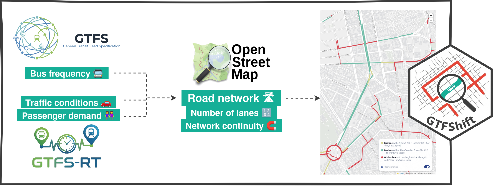
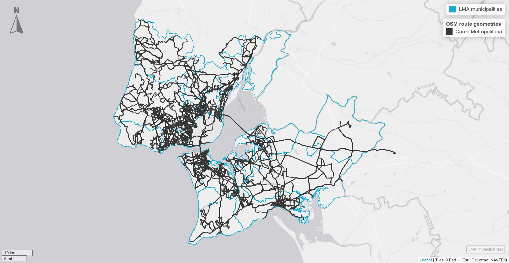
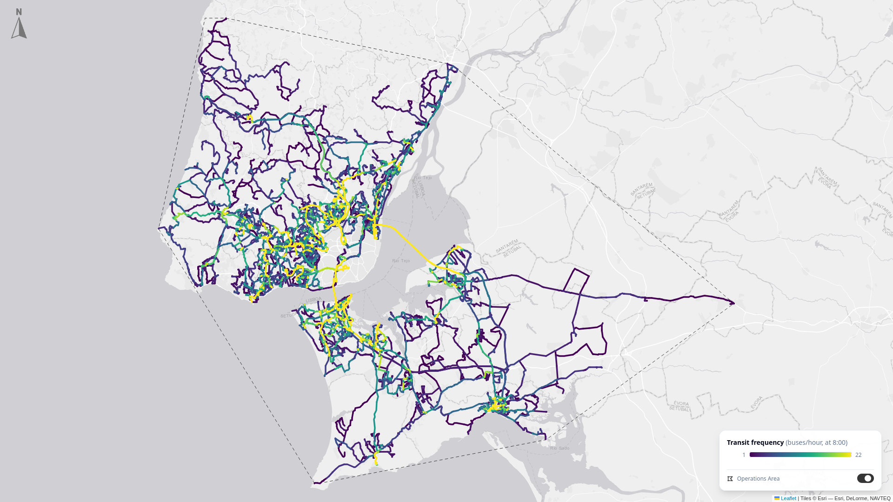
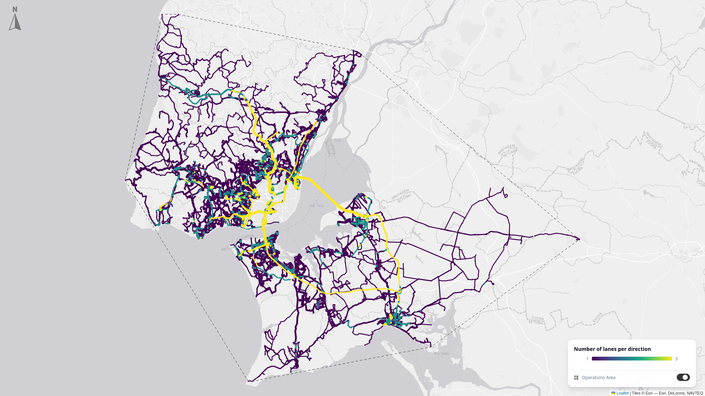
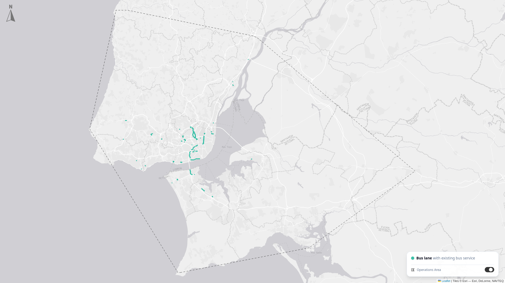
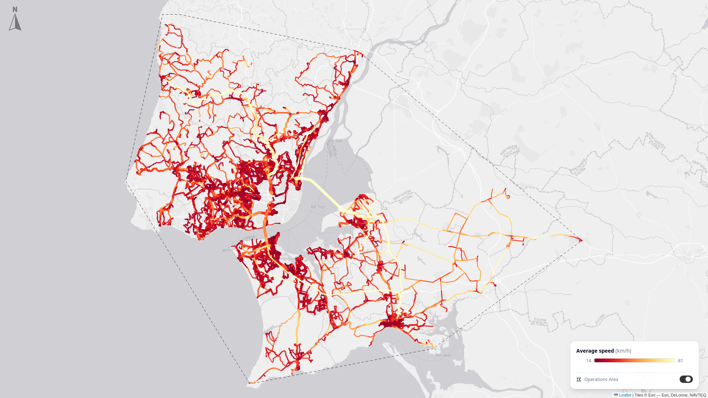
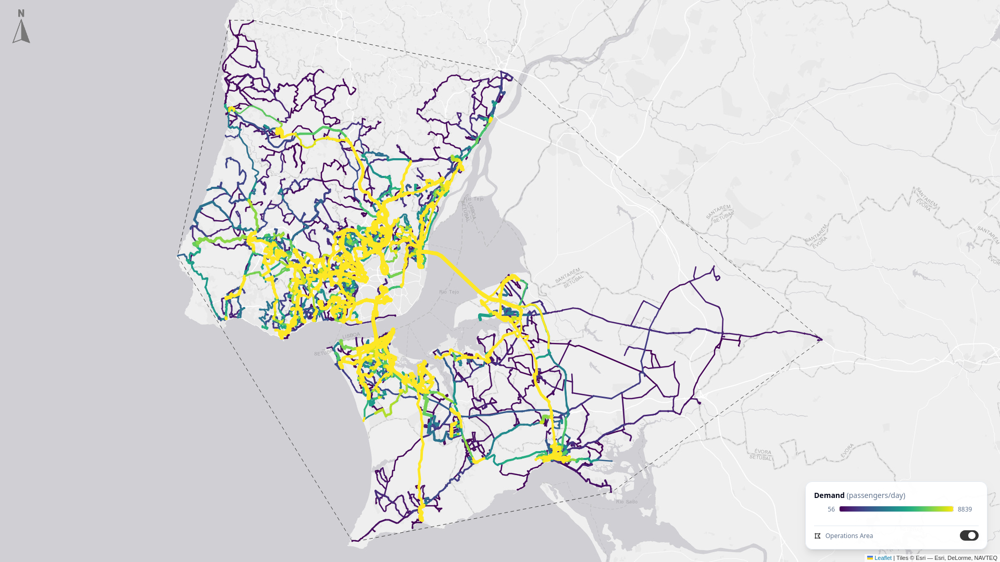

# Introduction

In the context of a global urbanization trend, with growing traffic congestion and the inherent negative impacts on the economy, environment and citizens quality of life, cities urge to implement measures to dignify and improve public transport efficiency, as a way to reduce car dependency and promote a more equitable and sustainable mobility [@vuchic1981; @rodrigue_geography_2024].

Improving bus operations is a key aspect of this challenge, as they are one of the most widely used public transport mode [@uitp_bus_2025]. Yet, when sharing road space with other vehicles, their efficiency is seriously injured, increasing costs and travel time to users, which reduces the attractiveness of public transport [@vuchic1981].

Bus lanes are a simple, yet often disputed solution, with the potential to improve the reliability of bus operations by limiting the negative impacts of traffic congestion [@cesme2018], reducing the variability of travel times [@surprenant-legault-2011], and increasing the average commercial speed -- which can ultimately be used to increase service frequency [@basso-2011].

They also contribute to a more equitable mobility. Considering the number of people each mode is able to move, @vuchic1981 advocates buses should be given between 5 to 50 times greater importance than a private vehicle. By prioritising the movement of people over vehicles, bus lanes enable the capacity increase of a single lane from 1.000-1.400, up to 4.000 people/hour when segregation is implemented [@uitp_regions_2025].

However, introducing them on road infrastructure still hampers other modes, such as private vehicles, which may experience a decrease in the level of service due to reduced allocated space [@arasan-2010], potentially jeopardizing public acceptance [@batty-2014]. It is therefore crutial to underlie bus lane implementation on reliable and robust information. 

To tackle this challenge, we present an open and reproductible methodology to identify and prioritise bus lane implementation. 
Founded on GTFS, OpenStreetMap (OSM) open data, and leveraging a methodology to harmonise these data sources developed by the authors [@gtfshift_paper_method], it enables to overcome the technical challenges of bus network aggregation and its integration with road network data and traffic conditions, providing a thorough set of indicators to support decision-making. 
This methodology is implemented using GTFShift, an open-source R package that operationalizes the full pipeline, from data ingestion to prioritisation output. 
This paper presents the methodology behind it and its application to the Lisbon Metropolitan Area, in Portugal, as a case study.

# Literature review

<!-- Extend with https://www.scopus.com/pages/ai?conversationId=6a5ca91d-126b-44a9-9bb8-f309b81ce9d5 -->

## Bus lanes benefits

Bus lanes (or transit priority lanes) have several benefits, not only for bus operations, but also for the overall public transport system and the city as a whole. 

By allocating mixed road space to buses, a lane can have its capacity to move people increased up to four times [@uitp_regions_2025], with several studies demonstrating its potential to improve the efficiency and reliability of bus services. 
Case studies reveal speed increases of 300% [@basso-2011], travel time reductions of up to 18% and waiting time reductions of about 12% [@russo_dedicated_2022], as well as increases of 65% in the probability of buses being on time [@surprenant-legault-2011]. 
An operational performance enhancement that enables the increment of bus frequencies betwen 20% [@russo_dedicated_2022] and 70% [@basso-2011], even with a smaller fleet [@basso-2011], but that goes beyond the numbers. 
Drivers enquired by @cordera_good_2024 reported also relevant impacts on their comfort and stress levels, as well as on the safety of both passengers and pedestrians.

Passengers, in turn, benefit from time savings at the stop and inside the vehicles, increasing their confidence in the bus system and the odds of switching to bus as a mode of transport, with studies showing a probability of modal shift between 26% [@russo_dedicated_2022] and 70% [@vedagiri_estimating_2009]. 
In constrast, a study on the effects of allowing private vehicles to use bus lanes in India found a 19pp decrease in the probability of modal transfer after cars were introduced in bus lanes [@mane_effect_2018].

From a social and spatial justice perspective, bus lanes are also a tool to promote more equitable mobility, as they prioritise the movement of people over vehicles and improve the provision of transport service to the entire population with a more economical and efficient use of public space, while having much lower externalities than other modes [@vuchic1981].

Moreover, when compared to other hard measures to contain congestion such as road pricing or public transport subsidies, bus lanes were the only capable of inducing changes in bus size, frequency, circulation speeds and spacing between stops [@basso-2011], making them highly relevant to improve the overall efficiency of the public transport system. 

Still, it is important to acknowledge that their benefits can be hampered or leveraged by their design and implementation. For instance, performance has been found to degrade when right-turns are allowed [@diab_understanding_2012]. 
On the other hand, pre-signals [@wu_bus_1998] enable a localized improvement of bus lane performance at intersections, while a continuous network of bus lanes has been found to generate a "multiplier effect" on the benefits induced. 
@truong-2015 has found that "travel time benefits and general traffic travel time disbenefits are proportional to the number of links with a bus lane", with sparse segments even having a negative effect on buses under certain circumstances.

## Obstacles to bus lane implementation

Despite the acknowledged benefits, introducing bus lanes on road infrastructure affects other modes, such as private vehicles, which may experience a decrease in the level of service due to reduced allocated space [@arasan-2010; @uk_study_2005; @russo_dedicated_2022], potentially jeopardizing public acceptance [@batty-2014; @cesme2018].

Nevertheless, modal transfer and the willingness of private vehicle users to avoid the roads that have had a capacity decrease due to bus lane implementation can mitigate these effects, as shown by @russo_dedicated_2022, who estimated motor-vehicle travel time increment after bus lane implementation to decrease from 4.10 min/km to 1.76 min/km (with a base line of 1.49 for mixed traffic) when considering a higher elasticity of car demand.

These, associated to the other already covered pros and cons and their inherent variability, makes it crutial to underlie bus lane implementation on reliable and robust information to guide an effective design, in a transparent process that involves all the stakeholders, associated to education and enforcement campaigns [@cesme2018].

## Criteria for bus lanes implementation

The literature presents several approaches to identify and prioritise bus lane implementation at a strategic level, that can be gathered in two main categories: threshold and performance based.

Threshold based approaches imply an a-priori definition of a set of criteria that must be met to justify the implementation of a bus lane. For instance, @vuchic1981 advocates that bus lanes should be implemented based on the number of lanes, vehicle volume per lane, ratio of average auto to bus occupancies and bus frequency per hour, combined in @fig-vuchic-criteria. 
In this figure we can observe, for instance, that for a street with 2 lanes ($N$) and 400 veh/h/lane ($q_A$) with a ratio of average auto to bus occupancies of 0.03 ($X$), the minimum bus frequency to justify its implementation is considered to be 12 bus/h ($q_B$).

![Travel volume warrant for bus lane introduction [@vuchic1981]](figures/lr/vuchinc.png){#fig-vuchic-criteria width=65%}

In a similar way, @nacto2016transit recommends that dedicated bus lanes should be applied "on major routes with frequent headways (10 minutes at peak) or where traffic congestion may significantly affect reliability". 
A review by @uk_study_2005 on the state of the practice in Korea, United Kingdom and United States of America revealed additional criteria, such as the passenger volume (per hour) and the number of lanes (per direction).

Conversely, performance based methods propose optimization models to evaluate the system as a whole, considering the effects of bus lane implementation on all modes and the overall efficiency of the transport system. 
For instance, @sun_combinatorial_2017 developed a multi-objective bi-level programming model to simultaneously optimize bus lane layout and bus frequency while minimizing travel time, emissions, and operating costs. 
Similarly, @tsitsokas_modeling_2021 employ combinatorial optimization and dynamic traffic modeling to identify the optimal spatial distribution of lanes across large-scale networks, explicitly accounting for queue spillbacks and "multiplier effects" from continuous lane segments.

Together, they build up a thorough set of indicators:

- Frequency of buses per hour and direction, at a peak hour [@uk_study_2005; @vuchic1981; @nacto2016transit; @tsitsokas_modeling_2021];
- Number of lanes in the same direction [@uk_study_2005; @vuchic1981];
- Traffic conditions [@uk_study_2005; @vuchic1981];
- Bus lanes network continuity [@tsitsokas_modeling_2021];
- Passenger demand [@uk_study_2005; @tsitsokas_modeling_2021] or detailed OD travel demand [@sun_combinatorial_2017; @tsitsokas_modeling_2021].

However, they vary in complexity and applicability. Performance based methods are the most comprehensive, but also the most complex, requiring more data and computational resources. They are also more difficult to implement and understand, which may limit their applicability in decision making processes and communication campaigns, which are key to ensure public acceptance and support for bus lane implementation [@cesme2018].

On the other hand and despite the simplicity of threshold methods, there is not a consensus on the threshold values to be used, nor yet a systematic and open approach for their processing and aggregation, an issue that may lead to inconsistent and non-reproducible results as authors report mismatches between different data sources [@vuurstaek_gtfs_2020; @gtfshift_paper_method].

This paper aims to tackle this gap by proposing a methodology that leverages open data and open-source tools to characterise and harmonise the several dimensions relevant to the bus lane implementation problem, enabling a deep analysis and understanding of the local context before applying any potential threshold values, that can be adjusted by the public decision makers to their specific needs. 
It aims to support a more transparent and evidence-based decision-making in urban transport planning.

# Data 

Characterising the several dimensions of the bus lane implementation problem involves the combination of inherently different data sources. 
To foster a systematic and reproducible approach, we have gathered three open data sources that enable to estimate the full set of relevant indicators found in the literature:

- **General Transit Feed Specification (GTFS)**, a widely adopted open data standard to distribute planned public transport data, including route geometries (shapes) and detailed schedules for service operations, from which we can infer the frequency of buses;

- **GTFS Realtime (GTFS-RT)**, an extension of GTFS that provides real-time information about how planned services perform in practice, such as vehicle position and occupation status, that can be used to determine proxies for travel speed and passenger demand;

- **OpenStreetMap (OSM)**, a community-driven map database providing detailed information about the road network geometry and topology, including the number of lanes and the existence of bus lanes.

# Methodology

The methodology presented in this paper leverages a previous work by the authors, that enables the harmonisation of GTFS shapes with OSM road network geometries, improving the spatial accuracy of bus route representation and unlocking a wide range of spatial analysis through the relation between the public transport network and the built infrastructure [@gtfshift_paper_method].

Bus lane prioritisation is one of its possible use cases. To apply the methodology to this end, the codebase previously developed and made available at the GTFShift R package, has been extended with several methods to collect, process the several dimensions of this problem, and gather them at the OSM road network level, enabling a comprehensive analysis of the conditions on the road network and the evaluation and weighting of the produced indicators according to the local context for bus lane implementation. 
The data sources and processing flow are schematically presented in @fig-method-diagram, and further detailed in the following subsections.

{#fig-method-diagram width="90%"}

It is important to disclose the assumption that the geometrical match between GTFS shapes and OSM road network geometries has been performed and OSM route relations have been updated accordingly, with `gtfs:route_id` and `gtfs:shape_id` tags, enabling a direct match between these data sources. This assumption prevents the duplication of the methodology presented in the previous paper and allows a greater focus on the application of the methodology to the bus lane prioritisation problem.

## Bus frequency

To quantify the number of buses that traverse each road segment at each hour, the `GTFShift::get_way_frequency_hourly()` method is used. This method spatially maps scheduled trips from GTFS data for a reference date $D$ onto OpenStreetMap (OSM) way segments, $\mathcal{W}$, using `GTFShift::osm_shapes_to_routes()` and aggregates them into hourly intervals.

For each scheduled trip $\tau \in T_D$, the departure hour $h(\tau) \in \{0, \dots, 23\}$ is determined by its departure time at the origin stop ($k = 1$):

$$h(\tau) = \left\lfloor \frac{t_{\text{dep}}(\tau, 1)}{3600} \right\rfloor$$

The total hourly transit frequency $F(w, h)$ traversing an OSM way segment $w \in \mathcal{W}$ during hour $h$ is obtained by aggregating the number of trips by their geometries (GTFS shapes) $s \in \mathcal{S}_w$ that pass through segment $w$ and have departed at hour $h$:

$$F(w, h) = \sum_{s \in \mathcal{S}_w} f(s, h)$$

where $f(s, h) = \left| \{ \tau \in T_D \mid s(\tau)=s, \; h(\tau)=h \} \right|$ is the number of trips using shape $s$ that depart at hour $h$, and $\mathcal{S}_w = \{s \in \mathcal{S} \mid m_{s,w}=1\}$ is the set of GTFS shapes map-matched to segment $w$ using `GTFShift::osm_shapes_to_routes()`, where $m_{s,w}=1$ indicates that shape $s$ traverses segment $w$. 

## Number of lanes

To evaluate road space availability for dedicated bus lane prioritisation, the number of circulation and parking lanes per direction is derived from OpenStreetMap (OSM) attributes using `GTFShift::prioritise_lanes()`.

The total number of circulation lanes $N_{\text{circ}}(w)$ for segment $w$ is parsed from OSM tags (`lanes`), falling back to directional tag sums (`lanes:forward`, `lanes:backward`, `lanes:both_ways`), or defaulting to $N_{\text{circ}}(w) = 1$ for one-way roads (`oneway = yes`) and $N_{\text{circ}}(w) = 2$ for bidirectional roads. The number of flow directions $N_{\text{dir}}(w) \in \{1, 2\}$ is determined by `oneway` tags, enforcing $N_{\text{dir}}(w) = 1$ when $N_{\text{circ}}(w) = 1$.

The per-direction circulation capacity $N_{\text{dir\_lanes}}(w)$ is calculated as:

$$N_{\text{dir\_lanes}}(w) = \max\left(1, \; \frac{N_{\text{circ}}(w)}{N_{\text{dir}}(w)}\right)$$

Additionally, on-street parking lanes $N_{\text{park}}(w) \in \{0, 1, 2\}$ are inferred by checking lateral parking tags (`parking:lane:left/right/both`), accounting for active parking restrictions.

## Network continuity

To evaluate network continuity and identify gaps between existing infrastructure and prioritized corridors, designated bus lanes are extracted from OpenStreetMap using `GTFShift::osm_bus_lanes()`.

For a spatial bounding box enclosing the study area, road network features tagged with public service vehicle (PSV) and dedicated bus lane attributes (such as `bus:lanes`, `lanes:bus`, `psv:lanes`, `lanes:psv`, and `psv`) are queried from OSM to construct a binary indicator $b(w) \in \{0, 1\}$ for each segment $w \in \mathcal{W}$:

$$b(w) = \begin{cases} 1 & \text{if segment } w \text{ contains an existing designated bus lane,} \\ 0 & \text{otherwise.} \end{cases}$$

Mapping $b(w)$ across the network reveals existing dedicated transit corridors, enabling spatial continuity analysis and network gap identification when evaluating candidates for new bus lane implementations.

## Traffic conditions

To characterize traffic conditions and evaluate bus speeds along transit corridors, segment operating speeds are derived using `GTFShift::rt_average_speed()`, as instantaneous speed readings, directly available in GTFS-RT feeds, might not reflect performance across an entire segment.

Real-time vehicle position data streams are collected using `GTFShift::rt_collect_json()` or `GTFShift::rt_collect_protobuf()`. Where necessary, route shape geometries are formatted into sorted continuous line features via `GTFShift::multiline_to_sorted_linestring()`. For each trip $\tau$, let $\{(x_i, t_i)\}_{i=1}^n$ denote the chronologically ordered sequence of vehicle position observations $x_i$ and timestamps $t_i$ ($t_1 \le t_2 \le \dots \le t_n$). Each position $x_i$ is projected onto the trip's route shape geometry $s(\tau)$ using `GTFShift::project_points_along_geometry()`, yielding forward $d_i$ and reverse $d_i^{\text{rev}}$ cumulative distances along the shape.

Between consecutive updates $(i-1, i)$, the elapsed time is $\Delta t_i = t_i - t_{i-1}$. To handle circular routes robustly, the spatial displacement $\Delta d_i$ is defined as:

$$\Delta d_i = \min\left(|d_i - d_{i-1}|, \; |d_i^{\text{rev}} - d_{i-1}^{\text{rev}}|\right)$$

The average operating speed $v_i$ between consecutive updates is then computed as:

$$v_i = \frac{\Delta d_i}{\Delta t_i}$$

Converting $v_i$ into kilometers per hour ($v_i^{\text{km/h}} = \frac{\Delta d_i / 1000}{\Delta t_i / 3600}$) yields localized bus speed metrics along the transit network, providing an empirical basis for assessing traffic-induced delays.

To aggregate these trip-level vehicle speeds onto the road network, `GTFShift::rt_extend_prioritisation()` spatially assigns real-time updates to OSM way segments using a spatial buffer $B(w)$ of radius $\delta = 15\text{ m}$ around each segment $w \in \mathcal{W}$. Filtering for active transit observations (`IN_TRANSIT_TO`), each segment $w$ captures a set of $N_w$ speed observations $\{v_1, \dots, v_{N_w}\}$. 

For each segment $w$, summary traffic performance indicators are calculated, including the mean operating speed $\bar{v}(w)$:

$$\bar{v}(w) = \frac{1}{N_w} \sum_{i=1}^{N_w} v_i$$

alongside median $v_{50}(w)$, 25th percentile $v_{25}(w)$, and 75th percentile $v_{75}(w)$ speeds. 

## Passenger demand

GTFS-RT feeds might report vehicle occupation via parameters such as `occupancy_percentage` or `occupancy_status` [@mobilitydata_gtfs_vehiclePosition], that can be used to estimate the number of passengers aboard each vehicle in real time.

As an alternative, bus operators can also provide APIs with daily passenger counts per route, which offer a more direct quantification of passenger demand. In the scope of this study, this latter option was used.

Route-level demand datasets are linked to GTFS route definitions by joining on the route short identifier (`route_short_name`), mapping each route $r \in \mathcal{R}$ to its observed daily demand $D(r)$. 

For each OSM way segment $w \in \mathcal{W}$, let $\mathcal{R}_w \subseteq \mathcal{R}$ denote the set of active GTFS routes map-matched to segment $w$. The cumulative daily passenger demand $D(w)$ traversing segment $w$ is calculated by unnesting the set of routes $\mathcal{R}_w$ and summing their respective daily demand values:

$$D(w) = \sum_{r \in \mathcal{R}_w} D(r)$$

where $D(r)$ represents the daily passenger demand assigned to route $r$. 

Mind that this approach might overestimate passenger demand, as it assumes that all passengers on a route use that segment. In reality, some passengers might board or alight at stops before or after that segment.

# Application to case study and prioritisation

## Case study

Carris Metropolitana, the bus operator for most of the Lisbon Metropolitan Area, was choosen to demonstrate and validate the application of the methodology and presented in this paper ^[All the code scripts executed to generate the outputs presented in this section are available at [github.com/U-Shift/GTFShift-web/tree/main/scripts/02_prioritise](https://github.com/U-Shift/GTFShift-web/tree/main/scripts/02_prioritise)]. 
With an operation covering its 18 municipalities (as urban operator in 15 and suburban in the remaining), it offers more than 700 bus routes to serve the 2.8 M residents of the region [@ine_populacao_2022], moving up to 19.2 M of passengers each month [@carris_metropolitana_nossa_nodate]. 
Its network is depicted in @fig-cs-network.

{#fig-cs-network width="75%"}

Furthermore, it provides a comprehensive API that provides not only the GTFS standards for planned and real-time monitoring of services, but also aditional endpoints that disclose operational metrics regarding complaints, delays, service execution or passenger demand [@carris_metropolitana_carrismetropolitanaapi_2026]. 
The wide geographical coverage combined with the availability of such rich operational data makes it a valuable case study to demonstrate and validate the application of the methodology presented in this paper.

## Results

The case study analysis was built upon the harmonisation results of GTFS shapes and OSM road network geometries, for a working day^[20/05/2026], by @gtfshift_paper_method, and considering a match of 92.76% of the GTFS shapes with OSM route relations, corresponding to 96.35% of the trips. 
Passenger demand was collected for the same day.
Additionally, a GTFS-RT dataset covering 14 business days^[13-30/04/2026] was used to calculate the speed-related metrics. 
The results for the dimensions analysed are synthesised in @tbl-results and complemented by the maps presented in @fig-results-maps. 

| Metric \ Dimension | Bus frequency (n, by length) | Nr lanes (n, by length) | Nr lanes (n, by frequency) | Speed (km/h, by length) | Speed (km/h, by frequency) | Passenger demand (n, by length) | Passenger demand (n, by frequency) | 
| :---- | --: | --: | --: | --: | --: | --: | --: |
| Mean | 6.86 | 1.32 | 1.27 | 34.5 | 25.51 | 2493 |	5190 |
| SD | 7.26 | 0.70 | 0.66 | 19.30 | 13.84 | 3642	| 6154 |
| P25 | 2.00 | 1.00 | 1.00 | 20.99 | 17.04 | 304	| 922 |
| P50 | 4.00 | 1.00 | 1.00 | 28.96 | 21.80 | 1123 |	2971 |
| P75 | 9.00 | 1.00 | 1.00 | 41.43 | 29.86 | 3263 |	6949 |
: Dimension specific results {#tbl-results}

\begin{quote}
\footnotesize
\textbf{Notes:} Bus frequency for peak hour (8:00). Results aggregated per road segment frequency or length, specified in the dimension header.
\end{quote}

Together, they reveal interesting patterns regarding bus operations and its relation with the infrastructure. 
On average, road segments carry a scheduled bus frequency of 6.86 buses/h (median of 4.00 buses/h), with highest values concentrated at the main accesses to the city of Lisbon, as well as in inner urban consolidated areas, such as the municipalities of Amadora, Almada, Odivelas, Oeiras, Seixal, Sesimbra or Setúbal (@fig-results-map-frequency).

However, these services are executed on a road network with limited capacity. 
The mean number of lanes per direction is 1.32 (1.27 when weighted by frequency), with all percentile values indicating that most segments have only one lane available per direction. @fig-results-map-nr-lanes illustrates this reality, with most of the network represented in purple, specially outside the main access corridors to the city of Lisbon.

Comparing spatial (by segment length) and operational (by bus frequency) aggregations reveals key performance dynamics. 
Most notably, operating speeds drop substantially when weighted by bus frequency: 
The mean speed decreases from 34.50 km/h to 25.51 km/h, and the median speed falls from 28.96 km/h to 21.80 km/h (with 25% of bus-weighted segments operating below 17.04 km/h). 
Their geographical distribution is aligned with the road capacity, with higher speeds being observed in the road segments that have more lanes available per direction, leaving the urban consolidated areas with the lowest speeds (@fig-results-map-speed).

This indicates that higher bus volumes are disproportionately concentrated on slower, more congested arterial segments. Segments where passenger demand is also higher, as it more than doubles under frequency weighting, with mean daily passenger volumes rising from 2,493 to 5,190 passengers (and median demand increasing from 1,123 to 2,971 passengers) (@fig-results-map-pax-demand).

Finally, from a network continuity perspective, @fig-results-map-bus-lanes reveals a sparse and fragmented bus lane infrastructure, mostly located in the city of Lisbon^[It is worth mentioning that the city of Lisbon has a greater extension of bus lanes that was not captured in this analysis, due to the fact that Carris Metropolitana only serves sub-urban bus services in this municipality and therefore does not have routes covering the entire municipal network.]. Of the 4,927 km of road segments serviced by Carris Metropolitana, only 36.20 km (less than 1%) have bus dedicated lanes.

::: {layout="[[50,50], [50,50], [-25, 50, -25]]" #fig-results-maps}
{#fig-results-map-frequency}

{#fig-results-map-nr-lanes}

{#fig-results-map-bus-lanes}

{#fig-results-map-speed}

{#fig-results-map-pax-demand}

Results maps per dimension
:::

\begin{quote}
\footnotesize
\textbf{Notes:} * Road segment weight proportional to the number of buses that go through it at peak hour (8:00).
\end{quote}

These findings emphasize that high-frequency bus corridors carry the overwhelming majority of transit riders under heavy congestion and tight space constraints, underscoring the critical need to extend the current bus lane infrastructure, which clearly reveals to be insufficient to meet the demand.

## Prioritisation

# Conclusion

<!-- This paper aims to tackle this gap by proposing a methodology that leverages open data and open-source tools to estimate the key indicators for bus lane implementation, providing a systematic and reproducible framework, customizable to different contexts and political requirements.
It aims to support a more transparent and evidence-based decision-making in urban transport planning. -->

# Acknowledgment {.unnumbered}

[_blind_]
<!-- This research was funded in part by the Fundação para a Ciência e a Tecnologia, I.P.
([FCT](https://ror.org/00snfqn58)) under Grant [UID/6438/2025](https://doi.org/10.54499/UID/06438/2025) of the research unit CERIS.
-->

# References {.unnumbered}

